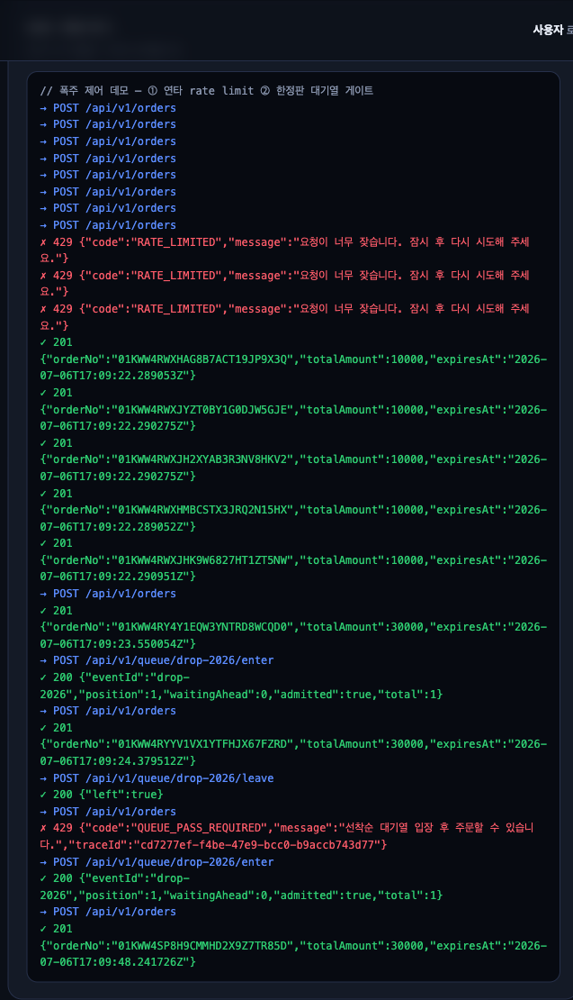
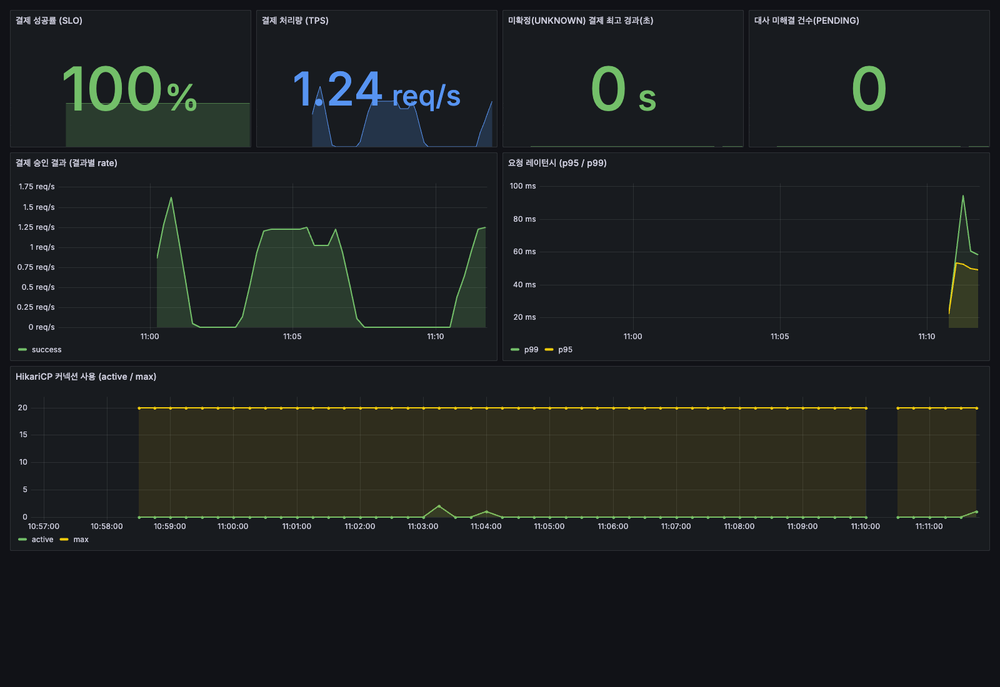
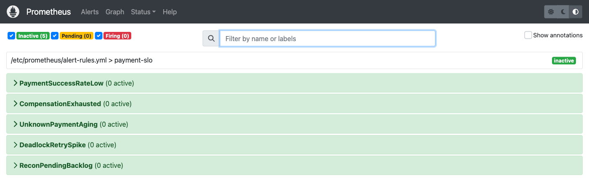

# pay — Spring Modulith 결제 시스템

[](https://github.com/dj258255/payment-system/actions/workflows/ci.yml)

실 서비스 운영을 상정해 만든 결제 백엔드. 결제의 정상 경로보다 **실패·정합성 처리**에 무게를 뒀다 —
타임아웃/중복/장애 같은 사건이 실제로 일어난다고 전제하고, 각 사건을 상태로 보존하고 확정하는 구조로 설계했다.

## 데모 콘솔

`docker compose up -d && ./gradlew bootRun` 후 `http://localhost:8080/` 에서 전 흐름을 눌러볼 수 있는 데모 콘솔을 함께 제공한다(Spring이 정적 서빙, same-origin이라 별도 프론트 서버·CORS 불필요).

**결제 플로우** — 로그인(JWT) → 주문 생성 → 결제 승인 → 취소/구매확정. 응답이 아니라 실제 API 호출·상태를 그대로 보여준다.


**운영 콘솔(ROLE_ADMIN)** — 미확정 결제 복구, 보상 태스크 재처리, 정산 대사, 강제취소 2인 승인, FDS 사후 심사, DLQ.


**강제취소 · 2인 승인(maker-checker)** — 요청자와 승인자가 반드시 달라야 실행된다. 요청자 본인이 승인하면 `MAKER_CHECKER_VIOLATION`으로 막힌다.


**폭주 유입 제어** — 같은 사용자의 연타는 rate limiter가 `429 RATE_LIMITED`로 쳐내고(사용자별 5/s + 전역 상한), 한정판 상품은 대기열 입장권 없이 주문하면 `429 QUEUE_PASS_REQUIRED`로 막힌다(입장 후 성공). 스파이크 실측: 폭주의 97.5%를 429로 거절하면서 성공 요청 p95는 738ms→52ms([docs/performance §7](docs/performance/README.md)).



**관측성(SLO 대시보드 · 알림)** — `docker compose --profile monitoring up -d prometheus grafana` 로 스택을 띄우면, Micrometer가 노출한 메트릭을 Prometheus가 수집하고 Grafana가 결제 SLO를 보여준다. 결제 성공률·처리량(TPS)·p95/p99 레이턴시·HikariCP 풀에 더해, 결제 도메인 고유 지표인 **미확정(UNKNOWN) 결제 최고 경과 시간**과 **대사 미해결(PENDING) 건수**를 커스텀 게이지로 노출한다.



대시보드와 같은 지표를 **알림 룰**로도 코드화했다(`monitoring/alert-rules.yml`) — 성공률<95%, 보상 재시도 소진, UNKNOWN 10분+ 방치, 데드락 재시도 폭증, 대사 PENDING 적체. 시스템이 건강하면 5개 모두 `inactive`다.



## 기술 스택

- **Java 21**, **Spring Boot 3.4**, **Spring Modulith 1.3**
- **MySQL 8.4** + JPA(도메인 모델), **Flyway**(스키마 마이그레이션)
- **Redis**(캐시·분산락), **Resilience4j**(서킷브레이커·재시도), **Kafka**(결제 이벤트 외부화 — 프로세스 밖 소비자용, 브로커 있을 때만)
- **Micrometer + Prometheus/Grafana**(관측성), **Spring Security**(인증·인가)
- 테스트: JUnit5 + Mockito, H2(동시성 실측), **426 tests** + Spring Modulith 경계 검증 + Toxiproxy 카오스(`chaosTest`)

## 아키텍처 — 모듈형 모놀리스

`com.beomsu.pay` 바로 아래 각 패키지가 하나의 애플리케이션 모듈이다. 모듈 간 통신은 직접 호출이 아니라
**도메인 이벤트**로 하고, 그 경계를 테스트(`ModularityTests`)가 강제한다. 규칙 위반 시 빌드가 깨진다.

```
com.beomsu.pay
├── order          주문 상태머신, 금액 위변조 검증, 체크아웃 오케스트레이션, 멱등키
├── payment        승인/취소/멱등/상태머신, PG 연동(3-상태), 망취소, 웹훅, 가상계좌
├── ledger         복식부기 원장 (차변=대변 불변식)
├── settlement     일 단위 배치 집계(서비스 루프; 대용량은 Spring Batch로 확장 여지)
├── escrow         자금 보류(에스크로) — 구매확정 전까지 HELD, 확정 시 RELEASED/취소 시 REFUNDED
├── reconciliation 대사 (내부 vs PG 파일 4분류)
├── notification   결제 이벤트 소비 (멱등 컨슈머 + DLQ)
├── point          포인트 원장 (복합결제)
├── subscription   빌링키 정기결제 + dunning
├── wallet         선불 충전 월렛 (전금법 한도)
├── fraud          이상거래탐지(FDS) 룰 엔진
└── shared         Money, ULID 등 공유 값 타입 (OPEN 모듈)
```

이벤트 발행은 Spring Modulith의 Event Publication Registry(= Transactional Outbox)로 신뢰성을 보장한다
([ADR-002](docs/adr/ADR-002-outbox-event-publication-registry.md)).
결제 이벤트는 Kafka로도 외부화되며, 별도 프로세스 소비자 데모는 [`consumer-app/`](consumer-app/README.md) 참고
([ADR-005](docs/adr/ADR-005-event-externalization-kafka.md)).

## 핵심 설계

| 영역 | 설계 |
|---|---|
| 신뢰 경계 | 금액·가격·userId를 클라이언트가 아니라 서버/인증 컨텍스트에서 정한다 (위변조·IDOR 차단) |
| 실패 처리 | PG 타임아웃을 `UNKNOWN`으로 보존 → 복구 배치가 조회로 확정 / 망취소 / 서킷브레이커 |
| 멱등성 | `Idempotency-Key` + DB 유니크 제약 (INSERT 성공 = 처리권 획득) |
| 이벤트 | Outbox → 멱등 컨슈머 → DLQ (유실·중복·순서역전 대응) |
| 정합성 | 복식부기 원장(차변=대변)으로 자금 이동을 수학적으로 검증, 대사가 최종 방어선 |
| 동시성 | 재고·잔액 차감 락 3종 비교 실측 후 조건부 UPDATE 채택 ([ADR-004](docs/adr/ADR-004-stock-deduction-locking.md)) |

## 실행

```bash
docker compose up -d              # MySQL 8.4 + Redis 7.4
./gradlew bootRun                 # Flyway 마이그레이션 후 기동 (localhost:8080)
```

부하테스트:
```bash
# 성능 측정 시 rate limiter를 끈다 — checkout-load는 데모 유저 1명이 반복 호출해
# per-user 5/s에 걸려 429가 섞이면 측정이 왜곡된다(spike-test는 반대로 rate limit on으로 shed 측정).
APP_RATELIMIT_ENABLED=false ./gradlew bootRun
k6 run k6/checkout-load.js        # 주문→승인 흐름 (인증 필요)
```

## 문서

- [docs/02 결제 도메인 핵심 개념](docs/02-결제도메인-핵심개념.md) — PG/VAN 구조, 결제 3단계, 상태머신
- [docs/03 아키텍처 설계](docs/03-아키텍처-설계.md) — 멱등성, Saga/Outbox, 원장, 웹훅, 정산/대사
- [docs/04 장애 시나리오 설계](docs/04-장애-시나리오-설계.md) — 외부 API 실패 처리 전반
- [docs/05 성능 전략](docs/05-성능개선-전략.md) — 동시성 제어, 부하테스트, 관측성
- [docs/09 ERD](docs/09-ERD-설계.md), [docs/10 API 스펙](docs/10-API-스펙.md)
- [docs/adr](docs/adr/) — 아키텍처 결정 기록

## 가정과 한계

결제의 실패·정합성 처리 설계에 집중한 데모다. 아래는 범위를 좁히기 위해 둔 의도적 단순화이며,
실서비스라면 어떻게 확장할지를 함께 적는다.

- **사용자**: 실 회원 도메인 대신 `InMemoryUserDetailsManager`(admin/admin2/1/2)를 쓴다.
  username을 그대로 userId로 사용한다. 실서비스라면 JPA 회원 엔티티 + BCrypt 저장 +
  DB 백엔드 `UserDetailsService`로 대체한다.
- **통화**: 단일 KRW(long, 원 단위)만 다룬다. 다통화는 미지원 — 실서비스라면 통화 코드와 최소단위
  스케일을 값 타입에 담아 확장한다.
- **시크릿**: JWT·필드 암호화·웹훅 서명 키 등은 로컬 개발용 기본값을 제공하되, 미설정/약한 키면
  기동을 실패시킨다(fail-fast). 운영에서는 반드시 환경변수/시크릿 매니저(KMS/Vault)로 주입한다.
- **멀티 PG**: `RoutingPgClient`(다중 PG failover)는 구현돼 있으나 아직 배선하지 않았다 —
  현재 경로는 Toss 단일 PG다. 실서비스라면 원 결제 PG 라우팅을 붙여 배선한다.
- **가상계좌·구독**: 서비스 계층까지 구현한 데모로, 외부 HTTP 발급 표면(엔드포인트)은 두지 않았다.
- **정산**: 일 단위 배치 집계를 서비스 루프로 처리한다. 대용량이면 Spring Batch(청크·재시작·병렬)로
  확장할 여지를 남겨 뒀다.
- **관측성 스크레이프**: `/actuator/prometheus`는 수집기가 인증 없이 주기 GET 해야 하므로 개방한다
  (나머지 actuator는 ADMIN). 운영에서는 `management.server.port`를 내부망 전용으로 분리해
  스크레이프하는 것이 정석이다. Prometheus/Grafana는 `monitoring` compose 프로필로 분리해 기본 기동에서 뺐다.
