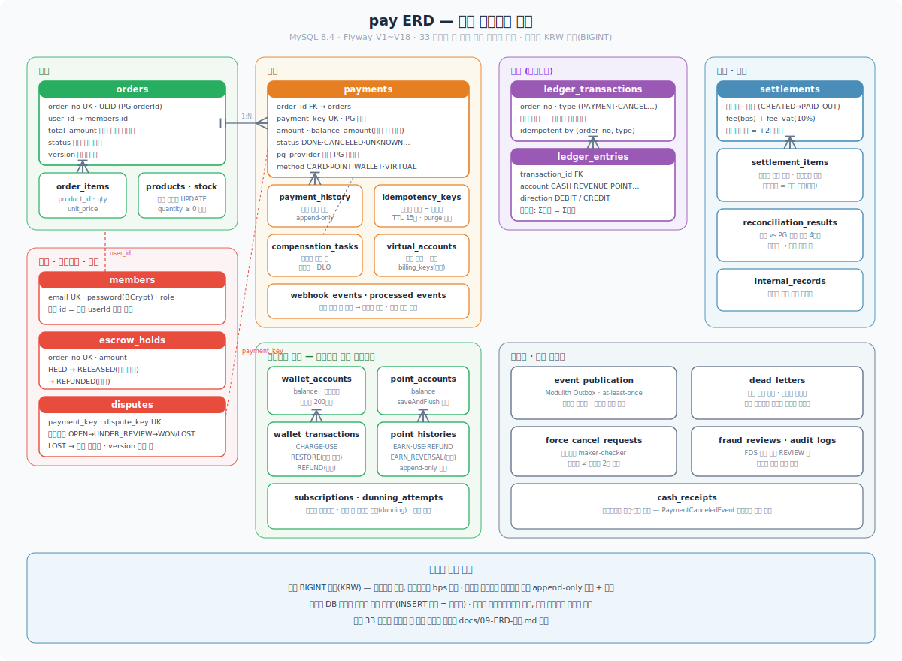
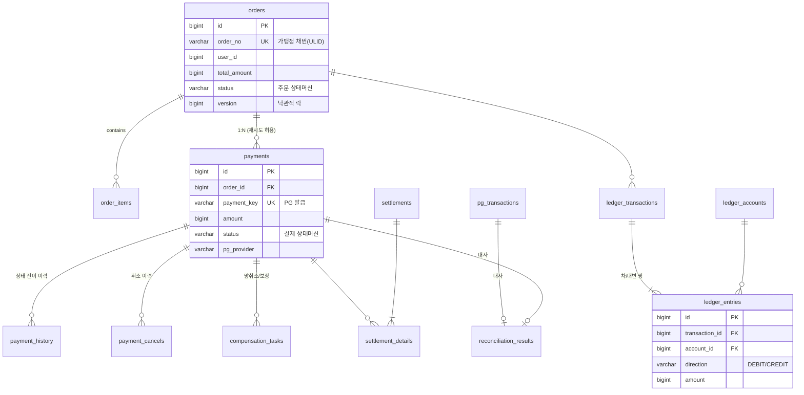

# 09. ERD 설계 — 테이블 스키마와 설계 결정

> 코어 스키마. 각 테이블마다 "왜 이렇게 설계했는가"를 함께 기록한다.
> DB: MySQL 8.x / 금액: KRW는 소수점이 없으므로 `BIGINT` (통화 확장 대비 `currency` 컬럼만 예약)

## 0. 전체 ERD



핵심 그룹만 표기한 다이어그램이고, 코어 관계는 아래 mermaid와 각 절의 DDL이 기준이다.



(멱등키·Outbox·웹훅 테이블은 특정 도메인에 종속되지 않는 인프라 테이블이라 위 다이어그램에서 생략 — 아래 개별 정의)

---

## 1. 주문 (orders / order_items)

```sql
CREATE TABLE orders (
    id              BIGINT AUTO_INCREMENT PRIMARY KEY,
    order_no        VARCHAR(64)  NOT NULL,             -- 가맹점 채번 (ULID) → PG의 orderId로 사용
    user_id         BIGINT       NOT NULL,
    total_amount    BIGINT       NOT NULL,             -- 최종 결제 예정 금액 (금액 위변조 검증 기준값)
    currency        CHAR(3)      NOT NULL DEFAULT 'KRW',
    status          VARCHAR(30)  NOT NULL,             -- CREATED → PENDING_PAYMENT → PAID → (PARTIAL_)CANCELED / EXPIRED / FAILED
    version         BIGINT       NOT NULL DEFAULT 0,   -- @Version 낙관적 락
    created_at      DATETIME(6)  NOT NULL,
    updated_at      DATETIME(6)  NOT NULL,
    UNIQUE KEY uk_orders_order_no (order_no),
    KEY idx_orders_user_created (user_id, created_at),
    KEY idx_orders_status_created (status, created_at)  -- 만료/복구 배치 스캔용
) ;

CREATE TABLE order_items (
    id              BIGINT AUTO_INCREMENT PRIMARY KEY,
    order_id        BIGINT       NOT NULL,
    product_id      BIGINT       NOT NULL,
    product_name    VARCHAR(200) NOT NULL,             -- ★ 스냅샷: 주문 시점 상품명
    unit_price      BIGINT       NOT NULL,             -- ★ 스냅샷: 주문 시점 가격
    quantity        INT          NOT NULL,
    KEY idx_order_items_order (order_id)
);
```

**설계 결정**
- **`order_no`는 ULID**: 자동증가 PK를 외부(PG·URL)에 노출하면 주문량 추정·순회 공격이 가능. 내부 조인은 BIGINT PK, 외부 식별은 ULID로 분리 (시간 정렬 가능해 UUID보다 인덱스 우호적)
- **`total_amount`가 금액 위변조 검증의 기준값**: successUrl로 돌아온 amount와 이 값을 비교 후에만 승인 호출 (02 문서)
- **order_items는 스냅샷**: 상품 가격이 나중에 바뀌어도 주문·정산·환불 금액은 주문 시점으로 고정 (velog @roycewon의 ProductSnapshot, 배민 정산의 Snapshot 엔티티와 동일 원리)
- 주문 상태와 결제 상태는 **별개의 상태머신** — 주문은 비즈니스 관점(배송·확정), 결제는 자금 관점

## 2. 결제 (payments / payment_history / payment_cancels)

```sql
CREATE TABLE payments (
    id              BIGINT AUTO_INCREMENT PRIMARY KEY,
    order_id        BIGINT       NOT NULL,
    payment_key     VARCHAR(200) NULL,                 -- PG(토스페이먼츠) 발급 키. 인증 전엔 NULL
    amount          BIGINT       NOT NULL,
    balance_amount  BIGINT       NOT NULL,             -- 취소 가능 잔액 (부분취소 누적 차감)
    status          VARCHAR(30)  NOT NULL,             -- READY / IN_PROGRESS / UNKNOWN / DONE / CANCELED / PARTIAL_CANCELED / ABORTED / EXPIRED
    method          VARCHAR(30)  NULL,                 -- CARD / VIRTUAL_ACCOUNT / TRANSFER ...
    pg_provider     VARCHAR(30)  NOT NULL DEFAULT 'TOSS_PAYMENTS',  -- 멀티 PG 확장 대비
    unknown_reason  VARCHAR(200) NULL,                 -- UNKNOWN 진입 사유 (타임아웃/5xx 등)
    version         BIGINT       NOT NULL DEFAULT 0,
    requested_at    DATETIME(6)  NOT NULL,
    approved_at     DATETIME(6)  NULL,
    UNIQUE KEY uk_payments_payment_key (payment_key),
    KEY idx_payments_order (order_id),
    KEY idx_payments_status_requested (status, requested_at)  -- 복구 배치: UNKNOWN/IN_PROGRESS 방치 건 스캔
);

CREATE TABLE payment_history (                          -- ★ append-only, UPDATE/DELETE 금지
    id              BIGINT AUTO_INCREMENT PRIMARY KEY,
    payment_id      BIGINT       NOT NULL,
    from_status     VARCHAR(30)  NOT NULL,
    to_status       VARCHAR(30)  NOT NULL,
    triggered_by    VARCHAR(20)  NOT NULL,             -- USER / WEBHOOK / POLLING / RECOVERY_BATCH / ADMIN
    reason          VARCHAR(500) NULL,
    created_at      DATETIME(6)  NOT NULL,
    KEY idx_payment_history_payment (payment_id, created_at)
);

CREATE TABLE payment_cancels (
    id                  BIGINT AUTO_INCREMENT PRIMARY KEY,
    payment_id          BIGINT       NOT NULL,
    cancel_amount       BIGINT       NOT NULL,
    cancel_reason       VARCHAR(200) NOT NULL,
    transaction_key     VARCHAR(200) NOT NULL,          -- PG가 취소 건마다 발급
    is_network_cancel   BOOLEAN      NOT NULL DEFAULT FALSE,  -- 망취소 구분
    canceled_at         DATETIME(6)  NOT NULL,
    UNIQUE KEY uk_cancels_tx_key (transaction_key),
    KEY idx_cancels_payment (payment_id)
);
```

**설계 결정**
- **orders : payments = 1:N** — 결제 실패 후 재시도하면 payment 레코드가 새로 생긴다. "주문당 성공한 결제는 1건"은 UNIQUE로 못 걸므로(MySQL은 partial unique index 없음) **주문 상태 조건부 UPDATE**(`WHERE status = 'PENDING_PAYMENT'`)로 이중 지불을 차단 — 이 결정 자체가 설계 판단
- **`UNKNOWN` 상태가 스키마에 존재** — 카카오페이 3-상태 모델(04 문서)을 상태머신에 1급 시민으로 반영. `unknown_reason`으로 진입 원인 추적
- **`balance_amount`**: 부분취소 누적 관리. `cancel_amount ≤ balance_amount` 검증 + 차감을 조건부 UPDATE로
- **payment_history는 감사(audit)의 최소 단위**: triggered_by로 "누가 이 전이를 일으켰나"(웹훅인지 배치인지 어드민인지)를 남긴다 — 전자금융거래법 기록 보존(08 문서)의 기반
- 상태 전이는 항상 `UPDATE payments SET status=:to, version=version+1 WHERE id=:id AND status=:from` — 영향 행 0이면 동시 전이 발생으로 판단

## 3. 멱등키 (idempotency_keys)

```sql
CREATE TABLE idempotency_keys (
    id              BIGINT AUTO_INCREMENT PRIMARY KEY,
    idempotency_key VARCHAR(300) NOT NULL,             -- 토스페이먼츠 스펙: 최대 300자
    api_path        VARCHAR(200) NOT NULL,
    http_method     VARCHAR(10)  NOT NULL,
    request_hash    VARCHAR(64)  NOT NULL,             -- SHA-256(요청 본문) — 같은 키 + 다른 본문 = 422
    status          VARCHAR(20)  NOT NULL,             -- PROCESSING / DONE
    response_status INT          NULL,
    response_body   JSON         NULL,                 -- 첫 응답 그대로 재반환용
    expires_at      DATETIME(6)  NOT NULL,             -- 생성 + 15일 (토스페이먼츠와 동일)
    created_at      DATETIME(6)  NOT NULL,
    UNIQUE KEY uk_idem (idempotency_key, api_path, http_method)   -- ★ 중복 판별 기준 = 키+주소+메서드
);
```

**설계 결정**
- 중복 판별 조합(키+경로+메서드)은 토스페이먼츠 스펙 미러링. **INSERT 성공 = 처리권 획득**이라는 원자적 잠금 효과 — 별도 분산락 불필요
- `status = PROCESSING`인데 재요청 → 409, `request_hash` 불일치 → 422 (03 문서의 에러 시맨틱)
- 만료 건은 배치로 삭제 (파티셔닝 또는 `expires_at` 인덱스)

## 4. 보상/망취소 작업 (compensation_tasks)

```sql
CREATE TABLE compensation_tasks (
    id              BIGINT AUTO_INCREMENT PRIMARY KEY,
    payment_id      BIGINT       NOT NULL,
    task_type       VARCHAR(30)  NOT NULL,             -- NETWORK_CANCEL / POINT_RESTORE / STOCK_RESTORE
    status          VARCHAR(20)  NOT NULL,             -- PENDING / DONE / FAILED / MANUAL   (FAILED = 재시도 소진)
    reason          VARCHAR(500) NOT NULL,
    retry_count     INT          NOT NULL DEFAULT 0,
    next_retry_at   DATETIME(6)  NOT NULL,             -- 망취소는 생성 + 1분 (즉시 취소하면 PG에 결제정보가 아직 없어 실패)
    created_at      DATETIME(6)  NOT NULL,
    KEY idx_comp_status_retry (status, next_retry_at)  -- 배치 스캔용
);
```

**설계 결정**
- 보상 요청을 **비즈니스 트랜잭션과 같은 트랜잭션으로 INSERT** → 보상 자체가 유실되지 않음 (Outbox와 동일 원리)
- `next_retry_at` 초기값 +1분: 망취소 지연 요구사항(02 문서)을 스키마 레벨에 반영
- 지수 백오프: 재시도마다 `next_retry_at = now + 2^retry_count 분`, 소진 시 `MANUAL` → 어드민 큐

## 5. 이벤트 (outbox_events / processed_events / webhook_events)

```sql
CREATE TABLE outbox_events (                            -- Transactional Outbox
    id              BIGINT AUTO_INCREMENT PRIMARY KEY,
    event_id        VARCHAR(36)  NOT NULL,             -- UUID — 컨슈머 멱등 처리의 키
    aggregate_type  VARCHAR(50)  NOT NULL,             -- PAYMENT / ORDER
    aggregate_id    BIGINT       NOT NULL,             -- 파티션 키로 사용 → 같은 결제의 이벤트 순서 보장
    event_type      VARCHAR(50)  NOT NULL,             -- PAYMENT_COMPLETED / PAYMENT_CANCELED ...
    payload         JSON         NOT NULL,             -- Zero-Payload 지향: 식별자+행위+시각 최소한만
    status          VARCHAR(20)  NOT NULL,             -- PENDING / PUBLISHED
    created_at      DATETIME(6)  NOT NULL,
    published_at    DATETIME(6)  NULL,
    UNIQUE KEY uk_outbox_event_id (event_id),
    KEY idx_outbox_status_created (status, created_at) -- Polling Publisher + "5분 이상 미발행 감지" 배치
);

CREATE TABLE processed_events (                         -- 멱등 컨슈머
    event_id        VARCHAR(36)  NOT NULL,
    consumer_group  VARCHAR(100) NOT NULL,
    processed_at    DATETIME(6)  NOT NULL,
    PRIMARY KEY (event_id, consumer_group)             -- ★ 같은 이벤트를 같은 컨슈머가 두 번 처리 불가
);

CREATE TABLE webhook_events (                           -- 수신 웹훅 원본 보관 (감사 + 재처리)
    id              BIGINT AUTO_INCREMENT PRIMARY KEY,
    external_event_id VARCHAR(200) NOT NULL,           -- PG가 준 이벤트 식별자 (없으면 payload 해시)
    event_type      VARCHAR(50)  NOT NULL,
    raw_payload     JSON         NOT NULL,             -- ★ 원본 그대로 — 파싱 실패해도 저장은 성공해야
    status          VARCHAR(20)  NOT NULL,             -- RECEIVED / PROCESSED / SKIPPED / FAILED
    received_at     DATETIME(6)  NOT NULL,
    processed_at    DATETIME(6)  NULL,
    UNIQUE KEY uk_webhook_external_id (external_event_id),   -- 중복 수신 멱등 처리
    KEY idx_webhook_status (status, received_at)
);
```

**설계 결정**
- `processed_events` PK에 `consumer_group` 포함 — 컨슈머가 여러 종류(알림·포인트·정산)일 때 각각 독립적으로 멱등
- 웹훅은 **"저장 먼저, 해석은 나중"**: raw_payload 저장 + 200 응답까지가 동기 구간, 상태 전이는 비동기 워커가 조회 API 재검증 후 수행 (03 문서 파이프라인)

## 6. 원장 (ledger_accounts / ledger_transactions / ledger_entries)

```sql
CREATE TABLE ledger_accounts (
    id              BIGINT AUTO_INCREMENT PRIMARY KEY,
    account_type    VARCHAR(40)  NOT NULL,             -- PG_RECEIVABLE / SALES / FEE_REVENUE / CLEARING / USER_BALANCE ...
    owner_id        BIGINT       NULL,                 -- 사용자/가맹점 계정이면 소유자, 시스템 계정이면 NULL
    currency        CHAR(3)      NOT NULL DEFAULT 'KRW',
    UNIQUE KEY uk_account (account_type, owner_id)
);

CREATE TABLE ledger_transactions (
    id              BIGINT AUTO_INCREMENT PRIMARY KEY,
    tx_type         VARCHAR(40)  NOT NULL,             -- PAYMENT_APPROVED / PAYMENT_CANCELED / SETTLEMENT_PAID ...
    source_type     VARCHAR(30)  NOT NULL,             -- PAYMENT / SETTLEMENT / ADMIN
    source_id       BIGINT       NOT NULL,             -- 원천 레코드 역참조 (Completeness 검증용)
    description     VARCHAR(200) NULL,
    created_at      DATETIME(6)  NOT NULL,
    UNIQUE KEY uk_ledger_tx_source (tx_type, source_type, source_id)  -- 같은 원천으로 같은 분개 중복 생성 방지
);

CREATE TABLE ledger_entries (                           -- ★ append-only. UPDATE/DELETE 권한 회수
    id              BIGINT AUTO_INCREMENT PRIMARY KEY,
    transaction_id  BIGINT       NOT NULL,
    account_id      BIGINT       NOT NULL,
    direction       VARCHAR(6)   NOT NULL,             -- DEBIT / CREDIT
    amount          BIGINT       NOT NULL,             -- 항상 양수. 부호는 direction으로
    created_at      DATETIME(6)  NOT NULL,
    KEY idx_entries_tx (transaction_id),
    KEY idx_entries_account_created (account_id, created_at)  -- 잔액 계산·Clearing 검증
);
```

**설계 결정 (Stripe Ledger 원칙 → 스키마)**
- **불변식 `sum(DEBIT) = sum(CREDIT)`** 는 분개 생성 서비스에서 강제 + **검증 배치**가 전체 재검산 (트리거는 성능·이식성 문제로 배제, ADR로 기록)
- `uk_ledger_tx_source`: 결제 1건이 이벤트 재처리로 두 번 분개되는 것을 DB가 차단 — 원장의 멱등성
- **amount는 항상 양수**: 음수 허용 시 direction과 이중 표현이 되어 버그 온상
- 잔액은 파생값. 조회 성능이 필요해지면 `ledger_balances` 스냅샷 테이블 추가 (원천은 항상 entries — 스냅샷 불일치 시 entries가 이긴다)
- 취소는 원거래 삭제가 아니라 **역분개(reversal) 추가**

**결제 승인 시 분개 예시** (금액 10,000 / 수수료 300):
| 계정 | DEBIT | CREDIT |
|---|---|---|
| PG_RECEIVABLE (PG에서 받을 돈) | 9,700 | |
| FEE_REVENUE에 대응하는 비용 | 300 | |
| SALES (매출) | | 10,000 |

## 7. 정산 (settlements / settlement_details)

```sql
CREATE TABLE settlements (
    id              BIGINT AUTO_INCREMENT PRIMARY KEY,
    merchant_id     BIGINT       NOT NULL,
    settlement_date DATE         NOT NULL,             -- 정산 기준일
    gross_amount    BIGINT       NOT NULL,             -- 거래 총액
    fee_amount      BIGINT       NOT NULL,             -- 수수료 합
    net_amount      BIGINT       NOT NULL,             -- 지급액 (gross - fee) — 불변식 검증 대상
    status          VARCHAR(20)  NOT NULL,             -- CREATED / CONFIRMED / PAID
    created_at      DATETIME(6)  NOT NULL,
    UNIQUE KEY uk_settlement (merchant_id, settlement_date)   -- ★ 배치 재실행 멱등성의 핵심
);

CREATE TABLE settlement_details (
    id              BIGINT AUTO_INCREMENT PRIMARY KEY,
    settlement_id   BIGINT       NOT NULL,
    payment_id      BIGINT       NOT NULL,
    payment_amount  BIGINT       NOT NULL,
    fee_rate        DECIMAL(5,4) NOT NULL,             -- 수수료율 스냅샷 (요율이 바뀌어도 당시 값 고정)
    fee_amount      BIGINT       NOT NULL,
    UNIQUE KEY uk_settle_detail (settlement_id, payment_id)
);
```

**설계 결정**
- `uk_settlement`: 정산 배치가 같은 날짜로 재실행되면 UPSERT 또는 삭제-재생성 — **배치 멱등성**을 스키마가 보장
- 집계 기간은 `start ≤ approved_at < end` 반개구간 (배민 정산 방식 — 경계 중복/누락 방지)
- `fee_rate` 스냅샷: 수수료율 변경 이력과 무관하게 "그 거래에 적용된 요율"을 고정

## 8. 대사 (pg_transactions / reconciliation_results)

```sql
CREATE TABLE pg_transactions (                          -- PG 정산 파일 적재 (D+1 도착분)
    id              BIGINT AUTO_INCREMENT PRIMARY KEY,
    file_id         VARCHAR(100) NOT NULL,             -- 파일 단위 재적재 멱등성
    transaction_key VARCHAR(200) NOT NULL,             -- ★ 대사 매칭 키 (승인일이 아닌 거래번호)
    payment_key     VARCHAR(200) NOT NULL,
    tx_type         VARCHAR(20)  NOT NULL,             -- APPROVE / CANCEL
    amount          BIGINT       NOT NULL,
    transacted_at   DATETIME(6)  NOT NULL,
    UNIQUE KEY uk_pg_tx (transaction_key, tx_type),
    KEY idx_pg_tx_file (file_id)
);

CREATE TABLE reconciliation_results (
    id              BIGINT AUTO_INCREMENT PRIMARY KEY,
    recon_date      DATE         NOT NULL,
    transaction_key VARCHAR(200) NULL,
    payment_id      BIGINT       NULL,
    result          VARCHAR(30)  NOT NULL,             -- MATCHED / INTERNAL_ONLY / EXTERNAL_ONLY / AMOUNT_MISMATCH
    internal_amount BIGINT       NULL,
    external_amount BIGINT       NULL,
    status          VARCHAR(20)  NOT NULL,             -- AUTO_RESOLVED / PENDING / TICKETED / MANUALLY_RESOLVED
    resolved_by     VARCHAR(50)  NULL,                 -- 수기 처리자 (어드민 감사)
    created_at      DATETIME(6)  NOT NULL,
    KEY idx_recon_date_result (recon_date, result)
);
```

**설계 결정**
- 정산 파일은 **원본 그대로 적재 후 매칭** (Modern Treasury의 Ingestion → Normalization → Reconciliation 3단계)
- 불일치 4분류(03 문서)가 `result` 컬럼의 enum으로 그대로 반영
- `MANUALLY_RESOLVED` + `resolved_by`: 수기 대사(어드민)의 감사 추적

## 9. 재고 — 동시성 실험용 (products / stock)

```sql
CREATE TABLE stock (
    product_id      BIGINT PRIMARY KEY,
    quantity        INT    NOT NULL,
    version         BIGINT NOT NULL DEFAULT 0,         -- 낙관적 락 실험용
    CHECK (quantity >= 0)                              -- 음수 재고의 최후 방어선
);
```
- Phase 5의 락 3종 비교 실험 대상: ① `@Version` 낙관적 ② `SELECT ... FOR UPDATE` 비관적 ③ Redisson — 같은 테이블로 구현체만 바꿔 부하테스트
- 조건부 차감: `UPDATE stock SET quantity = quantity - :n WHERE product_id = :id AND quantity >= :n`

## 10. 공통 규칙

| 규칙 | 근거 |
|---|---|
| 금액은 `BIGINT` (KRW), 항상 양수 + 방향/부호는 별도 컬럼 | 부동소수점 금지, 이중 표현 방지 |
| 모든 시각은 `DATETIME(6)` UTC | 정산 반개구간 경계의 나노초 문제 (배민) |
| 이력 테이블(payment_history, ledger_entries, webhook_events)은 append-only | 감사 추적, 전금법 5년 보존의 기반 |
| 외부 노출 식별자는 ULID, 내부 조인은 BIGINT PK | 순회 공격 방지 + 인덱스 성능 |
| FK 제약은 걸지 않고 인덱스만 (논리적 FK) | 대량 배치 성능·파티셔닝·이관 유연성 — 단 ADR로 트레이드오프 기록 |
| 배치가 스캔하는 모든 상태 컬럼에 `(status, 시각)` 복합 인덱스 | 복구/만료/발행 배치의 풀스캔 방지 |

## 11. 확장 표면 — 구현된 테이블 (회원·월렛·포인트·구독·분쟁)

초기엔 "확장 시" 후보였으나 이후 실제 구현된 스키마다. **잔액은 계정 테이블에 스냅샷으로 두되, 모든 변경은
append-only 이력 테이블에 남겨 감사·복구의 진실 원천으로 삼는다**(원장 발상과 동일).

- **회원**: `members`(id PK — auto_increment **1000부터**, 데모 InMemory userId 1/2와 충돌 방지 / `email` 유니크 /
  `password_hash` BCrypt / `role`). 로그인은 복합 `UserDetailsService`가 이메일→회원 조회 후 username을 숫자 id로 반환.
- **월렛**: `wallet_accounts`(user_id PK, balance, @Version) + `wallet_transactions`(append-only:
  `type` = CHARGE/USE/**RESTORE**/REFUND, `order_no` — 주문 단위 멱등/역산용). USE−RESTORE−REFUND = 활성 예약.
- **포인트**: `point_accounts`(user_id PK, balance, @Version) + `point_histories`(append-only:
  `type` = USE/RESTORE/REFUND/**EARN**/**EARN_REVERSAL**, `order_no`). 적립·회수를 이력으로 감사.
- **구독**: `billing_keys`(암호화 저장 + 블라인드 인덱스), `subscriptions`(상태머신 + @Version), `dunning_attempts`.
- **분쟁/차지백**: `disputes`(`chargeback_id` 유니크 — 웹훅 멱등키 / `order_no`·`payment_id` / `status` 상태머신 /
  `respond_by_deadline`·`evidence_memo`·`resolved_at` / **@Version** 동시 확정 레이스 차단). 패소 시 원장에
  `(txType=DISPUTE_LOST, sourceType=DISPUTE, sourceId=disputeId)` 유니크로 멱등 역분개.

## 확장 여지로 남긴 것

- **FDS**: `fds_rules`(무배포 룰 변경), `fds_evaluations`(판정 이력)
- **멀티 PG**: `payments.pg_provider` 활용 + `pg_channels`(가중치·헬스 상태)
