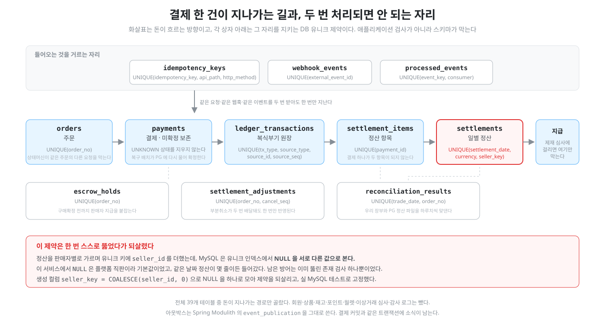
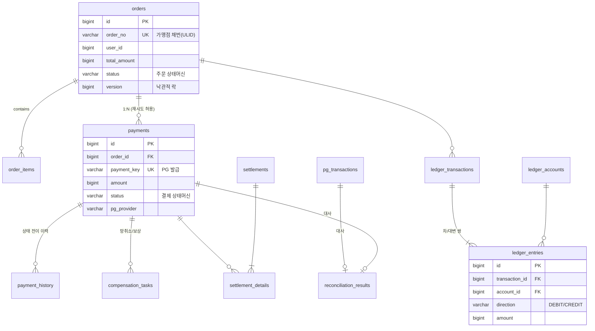

# 09. ERD 설계: 테이블 스키마와 설계 결정

> 코어 스키마. 각 테이블마다 "왜 이렇게 설계했는가"를 함께 기록한다.
> DB: MySQL 8.x / 금액: KRW는 소수점이 없으므로 `BIGINT` (통화 확장 대비 `currency` 컬럼만 예약)

## 0. 전체 ERD



**돈이 지나가는 경로만 골라 그렸고, 각 자리를 지키는 유니크 제약을 함께 적었다.** 전체는 **39개 테이블**이다(Spring Modulith 내장 `event_publication` 둘 제외). 코어 관계는 아래 mermaid와 각 절의 DDL이 기준이다.

> 이 문서는 설계 당시의 이름과 구현된 이름이 갈리는 자리가 있다. **`~~취소선~~`은 설계만 하고 안 만든 것**이고,
> 아래 12절은 **만들었는데 이 문서에 절이 없던 것** 14개를 DDL 까지 옮겨 둔 자리다.
> **유니크 키가 없는 표는 없다고 적어 뒀다.** 있는 줄 알고 쓰면 중복이 들어온다.


```mermaid
erDiagram
    orders ||--o{ order_items : contains
    orders ||--o{ payments : "1:N (재시도 허용)"
    payments ||--o{ payment_history : "상태 전이 이력"
    payments ||--o{ compensation_tasks : "망취소/보상"
    orders ||--o{ ledger_transactions : ""
    ledger_transactions ||--|{ ledger_entries : "차/대변 쌍"
    ledger_accounts ||--o{ ledger_entries : ""
    payments ||--o{ settlement_details : ""
    settlements ||--|{ settlement_details : ""
    pg_transactions ||--o| reconciliation_results : "대사"
    payments ||--o| reconciliation_results : "대사"

    orders {
        bigint id PK
        varchar order_no UK "가맹점 채번(ULID)"
        bigint user_id
        bigint total_amount
        varchar status "주문 상태머신"
        bigint version "낙관적 락"
    }
    payments {
        bigint id PK
        bigint order_id FK
        varchar payment_key UK "PG 발급"
        bigint amount
        varchar status "결제 상태머신"
        varchar pg_provider
    }
    ledger_entries {
        bigint id PK
        bigint transaction_id FK
        bigint account_id FK
        varchar direction "DEBIT/CREDIT"
        bigint amount
    }
```

(멱등키·Outbox·웹훅 테이블은 특정 도메인에 종속되지 않는 인프라 테이블이라 위 다이어그램에서 생략했고, 아래에서 개별 정의한다)

---

## 1. 주문 (orders / order_items)

```sql
CREATE TABLE orders (
    id              BIGINT AUTO_INCREMENT PRIMARY KEY,
    order_no        VARCHAR(64)  NOT NULL,             -- 가맹점 채번 (ULID) → PG의 orderId로 사용
    user_id         BIGINT       NOT NULL,
    total_amount    BIGINT       NOT NULL,             -- 최종 결제 예정 금액 (금액 위변조 검증 기준값)
    currency        CHAR(3)      NOT NULL DEFAULT 'KRW',
    status          VARCHAR(30)  NOT NULL,             -- CREATED → PENDING_PAYMENT → PAID → (PARTIAL_)CANCELED / EXPIRED / FAILED
    version         BIGINT       NOT NULL DEFAULT 0,   -- @Version 낙관적 락
    created_at      DATETIME(6)  NOT NULL,
    updated_at      DATETIME(6)  NOT NULL,
    UNIQUE KEY uk_orders_order_no (order_no),
    KEY idx_orders_user_created (user_id, created_at),
    KEY idx_orders_status_created (status, created_at)  -- 만료/복구 배치 스캔용
) ;

CREATE TABLE order_items (
    id              BIGINT AUTO_INCREMENT PRIMARY KEY,
    order_id        BIGINT       NOT NULL,
    product_id      BIGINT       NOT NULL,
    product_name    VARCHAR(200) NOT NULL,             -- ★ 스냅샷: 주문 시점 상품명
    unit_price      BIGINT       NOT NULL,             -- ★ 스냅샷: 주문 시점 가격
    quantity        INT          NOT NULL,
    KEY idx_order_items_order (order_id)
);
```

**설계 결정**
- **`order_no`는 ULID**: 자동증가 PK를 외부(PG·URL)에 노출하면 주문량 추정·순회 공격이 가능. 내부 조인은 BIGINT PK, 외부 식별은 ULID로 분리 (시간 정렬 가능해 UUID보다 인덱스 우호적)
- **`total_amount`가 금액 위변조 검증의 기준값**: successUrl로 돌아온 amount와 이 값을 비교 후에만 승인 호출 (02 문서)
- **order_items는 스냅샷**: 상품 가격이 나중에 바뀌어도 주문·정산·환불 금액은 주문 시점으로 고정 (velog @roycewon의 ProductSnapshot, 배민 정산의 Snapshot 엔티티와 동일 원리)
- 주문 상태와 결제 상태는 **별개의 상태머신**이다. 주문은 비즈니스 관점(배송·확정), 결제는 자금 관점이다

## 2. 결제 (payments / payment_history / ~~payment_cancels~~)

> **`payment_cancels`는 만들지 않았다.** 취소 이력은 `payment_history`에 상태 전이 이력의 하나로
> 함께 쌓는다. 별도 테이블로 나누면 "이 결제에 무슨 일이 있었나"를 두 테이블을 조인해야 알 수 있고,
> 부분취소가 여러 번이면 순서 재구성이 어려워진다. 부분취소 식별은 **취소 순번**으로 한다.

```sql
CREATE TABLE payments (
    id              BIGINT AUTO_INCREMENT PRIMARY KEY,
    order_id        BIGINT       NOT NULL,
    payment_key     VARCHAR(200) NULL,                 -- PG(토스페이먼츠) 발급 키. 인증 전엔 NULL
    amount          BIGINT       NOT NULL,
    balance_amount  BIGINT       NOT NULL,             -- 취소 가능 잔액 (부분취소 누적 차감)
    status          VARCHAR(30)  NOT NULL,             -- READY / IN_PROGRESS / UNKNOWN / DONE / CANCELED / PARTIAL_CANCELED / ABORTED / EXPIRED
    method          VARCHAR(30)  NULL,                 -- CARD / VIRTUAL_ACCOUNT / TRANSFER ...
    pg_provider     VARCHAR(30)  NOT NULL DEFAULT 'TOSS_PAYMENTS',  -- 멀티 PG 확장 대비
    unknown_reason  VARCHAR(200) NULL,                 -- UNKNOWN 진입 사유 (타임아웃/5xx 등)
    version         BIGINT       NOT NULL DEFAULT 0,
    requested_at    DATETIME(6)  NOT NULL,
    approved_at     DATETIME(6)  NULL,
    UNIQUE KEY uk_payments_payment_key (payment_key),
    KEY idx_payments_order (order_id),
    KEY idx_payments_status_requested (status, requested_at)  -- 복구 배치: UNKNOWN/IN_PROGRESS 방치 건 스캔
);

CREATE TABLE payment_history (                          -- ★ append-only, UPDATE/DELETE 금지
    id              BIGINT AUTO_INCREMENT PRIMARY KEY,
    payment_id      BIGINT       NOT NULL,
    from_status     VARCHAR(30)  NOT NULL,
    to_status       VARCHAR(30)  NOT NULL,
    triggered_by    VARCHAR(20)  NOT NULL,             -- USER / WEBHOOK / POLLING / RECOVERY_BATCH / ADMIN
    reason          VARCHAR(500) NULL,
    created_at      DATETIME(6)  NOT NULL,
    KEY idx_payment_history_payment (payment_id, created_at)
);

CREATE TABLE payment_cancels (   -- (미구현) 취소 이력은 payment_history에 함께 쌓는다
    id                  BIGINT AUTO_INCREMENT PRIMARY KEY,
    payment_id          BIGINT       NOT NULL,
    cancel_amount       BIGINT       NOT NULL,
    cancel_reason       VARCHAR(200) NOT NULL,
    transaction_key     VARCHAR(200) NOT NULL,          -- PG가 취소 건마다 발급
    is_network_cancel   BOOLEAN      NOT NULL DEFAULT FALSE,  -- 망취소 구분
    canceled_at         DATETIME(6)  NOT NULL,
    UNIQUE KEY uk_cancels_tx_key (transaction_key),
    KEY idx_cancels_payment (payment_id)
);
```

**설계 결정**
- **orders : payments = 1:N**이다. 결제 실패 후 재시도하면 payment 레코드가 새로 생긴다. "주문당 성공한 결제는 1건"은 UNIQUE로 못 걸므로(MySQL은 partial unique index 없음) **주문 상태 조건부 UPDATE**(`WHERE status = 'PENDING_PAYMENT'`)로 이중 지불을 차단한다. 이 결정 자체가 설계 판단이다
- **`UNKNOWN` 상태가 스키마에 존재**한다. 카카오페이 3-상태 모델(04 문서)을 상태머신에 1급 시민으로 반영. `unknown_reason`으로 진입 원인 추적
- **`balance_amount`**: 부분취소 누적 관리. `cancel_amount ≤ balance_amount` 검증 + 차감을 조건부 UPDATE로
- **payment_history는 감사(audit)의 최소 단위**: triggered_by로 "누가 이 전이를 일으켰나"(웹훅인지 배치인지 어드민인지)를 남긴다. 전자금융거래법 기록 보존(08 문서)의 기반이다
- 상태 전이는 항상 `UPDATE payments SET status=:to, version=version+1 WHERE id=:id AND status=:from`이고, 영향 행 0이면 동시 전이 발생으로 판단한다

## 3. 멱등키 (idempotency_keys)

```sql
CREATE TABLE idempotency_keys (
    id              BIGINT AUTO_INCREMENT PRIMARY KEY,
    idempotency_key VARCHAR(300) NOT NULL,             -- 토스페이먼츠 스펙: 최대 300자
    api_path        VARCHAR(200) NOT NULL,
    http_method     VARCHAR(10)  NOT NULL,
    request_hash    VARCHAR(64)  NOT NULL,             -- SHA-256(요청 본문) — 같은 키 + 다른 본문 = 422
    status          VARCHAR(20)  NOT NULL,             -- PROCESSING / DONE
    response_status INT          NULL,
    response_body   JSON         NULL,                 -- 첫 응답 그대로 재반환용
    expires_at      DATETIME(6)  NOT NULL,             -- 생성 + 15일 (토스페이먼츠와 동일)
    created_at      DATETIME(6)  NOT NULL,
    UNIQUE KEY uk_idem (idempotency_key, api_path, http_method)   -- ★ 중복 판별 기준 = 키+주소+메서드
);
```

**설계 결정**
- 중복 판별 조합(키+경로+메서드)은 토스페이먼츠 스펙 미러링. **INSERT 성공 = 처리권 획득**이라는 원자적 잠금 효과다. 별도 분산락은 불필요
- `status = PROCESSING`인데 재요청 → 409, `request_hash` 불일치 → 422 (03 문서의 에러 시맨틱)
- 만료 건은 배치로 삭제 (파티셔닝 또는 `expires_at` 인덱스)

## 4. 보상/망취소 작업 (compensation_tasks)

```sql
CREATE TABLE compensation_tasks (
    id              BIGINT AUTO_INCREMENT PRIMARY KEY,
    payment_id      BIGINT       NOT NULL,
    task_type       VARCHAR(30)  NOT NULL,             -- NETWORK_CANCEL / POINT_RESTORE / STOCK_RESTORE
    status          VARCHAR(20)  NOT NULL,             -- PENDING / DONE / FAILED / MANUAL   (FAILED = 재시도 소진)
    reason          VARCHAR(500) NOT NULL,
    retry_count     INT          NOT NULL DEFAULT 0,
    next_retry_at   DATETIME(6)  NOT NULL,             -- 망취소는 생성 + 1분 (즉시 취소하면 PG에 결제정보가 아직 없어 실패)
    created_at      DATETIME(6)  NOT NULL,
    KEY idx_comp_status_retry (status, next_retry_at)  -- 배치 스캔용
);
```

**설계 결정**
- 보상 요청을 **비즈니스 트랜잭션과 같은 트랜잭션으로 INSERT** → 보상 자체가 유실되지 않음 (Outbox와 동일 원리)
- `next_retry_at` 초기값 +1분: 망취소 지연 요구사항(02 문서)을 스키마 레벨에 반영
- 지수 백오프: 재시도마다 `next_retry_at = now + 2^retry_count 분`, 소진 시 `MANUAL` → 어드민 큐

## 5. 이벤트 (outbox_events / processed_events / webhook_events)

> **실물과 다르다 — 아래 `outbox_events`는 채택되지 않은 설계다.** ADR-002에서 직접 만드는 대신
> Spring Modulith의 Event Publication Registry를 쓰기로 했고, 실제 테이블은
> **`event_publication`**(+ `event_publication_archive`)이다. 이 절의 `outbox_events` DDL은
> "직접 짰다면 이렇게 했을 것"의 기록으로 남긴다 — 아래 5-1에 실물 스키마를 적었다.
> `processed_events`와 `webhook_events`는 설명대로 실재한다.

```sql
CREATE TABLE outbox_events (   -- (미구현) 실제 이름: event_publication (Modulith, 5-1절)
    id              BIGINT AUTO_INCREMENT PRIMARY KEY,
    event_id        VARCHAR(36)  NOT NULL,             -- UUID — 컨슈머 멱등 처리의 키
    aggregate_type  VARCHAR(50)  NOT NULL,             -- PAYMENT / ORDER
    aggregate_id    BIGINT       NOT NULL,             -- 파티션 키로 사용 → 같은 결제의 이벤트 순서 보장
    event_type      VARCHAR(50)  NOT NULL,             -- PAYMENT_COMPLETED / PAYMENT_CANCELED ...
    payload         JSON         NOT NULL,             -- Zero-Payload 지향: 식별자+행위+시각 최소한만
    status          VARCHAR(20)  NOT NULL,             -- PENDING / PUBLISHED
    created_at      DATETIME(6)  NOT NULL,
    published_at    DATETIME(6)  NULL,
    UNIQUE KEY uk_outbox_event_id (event_id),
    KEY idx_outbox_status_created (status, created_at) -- Polling Publisher + "5분 이상 미발행 감지" 배치
);

CREATE TABLE processed_events (                         -- 멱등 컨슈머
    event_id        VARCHAR(36)  NOT NULL,
    consumer_group  VARCHAR(100) NOT NULL,
    processed_at    DATETIME(6)  NOT NULL,
    PRIMARY KEY (event_id, consumer_group)             -- ★ 같은 이벤트를 같은 컨슈머가 두 번 처리 불가
);

CREATE TABLE webhook_events (                           -- 수신 웹훅 원본 보관 (감사 + 재처리)
    id              BIGINT AUTO_INCREMENT PRIMARY KEY,
    external_event_id VARCHAR(200) NOT NULL,           -- PG가 준 이벤트 식별자 (없으면 payload 해시)
    event_type      VARCHAR(50)  NOT NULL,
    raw_payload     JSON         NOT NULL,             -- ★ 원본 그대로 — 파싱 실패해도 저장은 성공해야
    status          VARCHAR(20)  NOT NULL,             -- RECEIVED / PROCESSED / SKIPPED / FAILED
    received_at     DATETIME(6)  NOT NULL,
    processed_at    DATETIME(6)  NULL,
    UNIQUE KEY uk_webhook_external_id (external_event_id),   -- 중복 수신 멱등 처리
    KEY idx_webhook_status (status, received_at)
);
```

**설계 결정**
- `processed_events` PK에 `consumer_group`을 포함한다. 컨슈머가 여러 종류(알림·포인트·정산)일 때 각각 독립적으로 멱등
- 웹훅은 **"저장 먼저, 해석은 나중"**: raw_payload 저장 + 200 응답까지가 동기 구간, 상태 전이는 비동기 워커가 조회 API 재검증 후 수행 (03 문서 파이프라인)

### 5-1. 실물 아웃박스 (event_publication / event_publication_archive)

Modulith가 정의하는 스키마이고, 이 프로젝트는 Flyway가 생성·관리한다(V1, V24).

```sql
CREATE TABLE event_publication (                        -- 미소비 이벤트만 남는 "핫" 테이블
    id               BINARY(16)   NOT NULL,            -- UUID
    publication_date DATETIME(6),                      -- 발행 시각 (= 발행 트랜잭션 커밋 시점)
    completion_date  DATETIME(6),                      -- 소비 완료 시각. NULL = 아직 처리 안 됨
    event_type       VARCHAR(255),
    listener_id      VARCHAR(255),                     -- 리스너 메서드 시그니처. 리스너마다 행이 1개씩
    serialized_event VARCHAR(255),                     -- 이벤트 JSON. 실측 최대 116자
    PRIMARY KEY (id),
    KEY idx_event_pub_lookup (listener_id, serialized_event(191)),   -- ★ V24. 완료 처리 핫패스
    KEY idx_event_pub_incomplete (completion_date, publication_date) -- ★ V24. 재기동 시 미완료 재발행
);

CREATE TABLE event_publication_archive (                -- ★ V24. 완료분이 여기로 옮겨진다
    ...                                                 -- 컬럼 구성은 위와 동일
);
```

**설계 결정**
- **리스너 1개당 행 1개다.** 이벤트 1건이 아니다. `PaymentConfirmedEvent`는 리스너가 6개
  (정산·알림·원장·대사·에스크로·이상거래)라 결제 한 건이 행 6개를 만든다. 이 배수를 놓치면
  테이블 증가 속도를 6배 과소평가한다.
- **완료분은 아카이브로 옮긴다**(`completion-mode: archive`). 기본값 `update`는 완료 행을
  영원히 남겨 무한히 자란다 — 부하 실험 6회에 150,372행이 됐다. `delete`가 아니라 `archive`인
  이유는 "무엇이 언제 발행됐는가"가 결제 시스템에서 감사 자료이기 때문이다.
- **인덱스 둘은 실측 후에 넣었다.** Modulith가 만드는 기본 스키마에는 PK밖에 없어서, 리스너
  완료마다 도는 갱신이 전부 풀스캔이었다(`EXPLAIN`: `type=ALL`, `rows=150372`).
  결제 지연이 현재 부하가 아니라 **누적 이벤트 수**에 비례해 나빠지고 있었다.
  경위와 수치는 성능 리포트 10절, 판단은 ADR-002 말미에 있다.
- **소비는 비동기다.** 결제가 200으로 응답한 시점에 정산·원장은 아직일 수 있다. 이건 정상이고,
  구분해야 할 건 "밀리는 중"과 "멈춤"이다. `outbox.pending.oldest.age` 게이지로 본다 —
  개수가 아니라 나이여야 둘이 갈린다.

## 6. 원장 (~~ledger_accounts~~ / ledger_transactions / ledger_entries)

> **`ledger_accounts`는 테이블이 아니라 enum이다**(`AccountType`: `PG_RECEIVABLE`, `SALES`,
> `CASH`, `PG_FEE`). 계정과목은 운영 중 늘어나는 데이터가 아니라 코드가 아는 고정 집합이고,
> 테이블로 두면 분개 코드가 문자열·ID로 계정을 참조하게 되어 오타가 컴파일에 안 잡힌다.

```sql
CREATE TABLE ledger_accounts (   -- (미구현) 계정과목은 테이블이 아니라 enum AccountType
    id              BIGINT AUTO_INCREMENT PRIMARY KEY,
    account_type    VARCHAR(40)  NOT NULL,             -- PG_RECEIVABLE / SALES / FEE_REVENUE / CLEARING / USER_BALANCE ...
    owner_id        BIGINT       NULL,                 -- 사용자/가맹점 계정이면 소유자, 시스템 계정이면 NULL
    currency        CHAR(3)      NOT NULL DEFAULT 'KRW',
    UNIQUE KEY uk_account (account_type, owner_id)
);

CREATE TABLE ledger_transactions (
    id              BIGINT AUTO_INCREMENT PRIMARY KEY,
    tx_type         VARCHAR(40)  NOT NULL,             -- PAYMENT_APPROVED / PAYMENT_CANCELED / SETTLEMENT_PAID ...
    source_type     VARCHAR(30)  NOT NULL,             -- PAYMENT / SETTLEMENT / ADMIN
    source_id       BIGINT       NOT NULL,             -- 원천 레코드 역참조 (Completeness 검증용)
    description     VARCHAR(200) NULL,
    created_at      DATETIME(6)  NOT NULL,
    UNIQUE KEY uk_ledger_tx_source (tx_type, source_type, source_id)  -- 같은 원천으로 같은 분개 중복 생성 방지
);

CREATE TABLE ledger_entries (                           -- ★ append-only. UPDATE/DELETE 권한 회수
    id              BIGINT AUTO_INCREMENT PRIMARY KEY,
    transaction_id  BIGINT       NOT NULL,
    account_id      BIGINT       NOT NULL,
    direction       VARCHAR(6)   NOT NULL,             -- DEBIT / CREDIT
    amount          BIGINT       NOT NULL,             -- 항상 양수. 부호는 direction으로
    created_at      DATETIME(6)  NOT NULL,
    KEY idx_entries_tx (transaction_id),
    KEY idx_entries_account_created (account_id, created_at)  -- 잔액 계산·Clearing 검증
);
```

**설계 결정 (Stripe Ledger 원칙 → 스키마)**
- **불변식 `sum(DEBIT) = sum(CREDIT)`** 는 분개 생성 서비스에서 강제 + **검증 배치**가 전체 재검산 (트리거는 성능·이식성 문제로 배제, ADR로 기록)
- `uk_ledger_tx_source`: 결제 1건이 이벤트 재처리로 두 번 분개되는 것을 DB가 차단한다. 원장의 멱등성이다
- **amount는 항상 양수**: 음수 허용 시 direction과 이중 표현이 되어 버그 온상
- 잔액은 파생값. 조회 성능이 필요해지면 `ledger_balances` 스냅샷 테이블 추가 (원천은 항상 entries이며, 스냅샷 불일치 시 entries가 이긴다)
- 취소는 원거래 삭제가 아니라 **역분개(reversal) 추가**

**결제 승인 시 분개 예시** (금액 10,000 / 수수료 300):
| 계정 | DEBIT | CREDIT |
|---|---|---|
| PG_RECEIVABLE (PG에서 받을 돈) | 9,700 | |
| FEE_REVENUE에 대응하는 비용 | 300 | |
| SALES (매출) | | 10,000 |

## 7. 정산 (settlements / settlement_items)

> **`settlement_details`의 실제 이름은 `settlement_items`다.** 아래 DDL의 테이블명만 다르고
> 구조는 대응한다. 항목에 상태(`PENDING_CONFIRMATION`/`CONFIRMED`/`SETTLED`/`CANCELED`)가
> 붙은 것이 설계 당시와 달라진 점이다.

```sql
CREATE TABLE settlements (
    id              BIGINT AUTO_INCREMENT PRIMARY KEY,
    seller_id       BIGINT       NULL,          -- NULL 이면 플랫폼 직판(V37)
    settlement_date DATE         NOT NULL,             -- 정산 기준일
    currency        VARCHAR(3)   NOT NULL,             -- ISO 4217. 정산은 통화별로 따로 만든다
    gross_amount    BIGINT       NOT NULL,             -- 거래 총액(해당 통화의 최소 단위)
    fee_amount      BIGINT       NOT NULL,             -- 수수료 합
    net_amount      BIGINT       NOT NULL,             -- 지급액 (gross - fee) — 불변식 검증 대상
    status          VARCHAR(20)  NOT NULL,             -- CREATED / CONFIRMED / PAID
    created_at      DATETIME(6)  NOT NULL,
    seller_key      BIGINT       AS (COALESCE(seller_id,0)) STORED,  -- 유니크 전용(V42)
    UNIQUE KEY uk_settlement_date_currency_seller (settlement_date, currency, seller_key)   -- ★ 배치 재실행 멱등성의 핵심
    -- 통화가 키에 없으면 같은 날 KRW·USD 정산이 둘 다 못 나온다. 그렇다고 제약을 풀면
    -- 같은 날짜를 두 번 집계해 지급이 두 배가 되는 것을 못 막는다(ADR-016).
);

CREATE TABLE settlement_details (   -- 실제 이름: settlement_items
    id              BIGINT AUTO_INCREMENT PRIMARY KEY,
    settlement_id   BIGINT       NOT NULL,
    payment_id      BIGINT       NOT NULL,
    payment_amount  BIGINT       NOT NULL,
    fee_rate        DECIMAL(5,4) NOT NULL,             -- 수수료율 스냅샷 (요율이 바뀌어도 당시 값 고정)
    fee_amount      BIGINT       NOT NULL,
    UNIQUE KEY uk_settle_detail (settlement_id, payment_id)
);
```

**설계 결정**
- `uk_settlement_date_currency_seller`: 정산 배치가 같은 날짜로 재실행되면 UPSERT 또는 삭제-재생성한다. **배치 멱등성**을 스키마가 보장.
  판매자가 NULL(플랫폼 직판)이면 MySQL 이 NULL 을 서로 다른 값으로 봐서 제약이 안 걸리므로, **V42 가 생성 컬럼 `seller_key` 로 NULL 을 0 에 모아** 제약을 완성했다
- 집계 기간은 `start ≤ approved_at < end` 반개구간 (배민 정산 방식으로 경계 중복/누락 방지)
- `fee_rate` 스냅샷: 수수료율 변경 이력과 무관하게 "그 거래에 적용된 요율"을 고정

## 8. 대사 (pg_transactions / reconciliation_results)

```sql
-- 아래 pg_transactions는 만들지 않았다. PG 정산 파일의 각 행은 대사 실행 중에만 필요한
-- 값이라 `ExternalRecord`(자바 record, 비영속)로 파싱해 흘리고, 대사 <결과>만
-- `reconciliation_results`에 남긴다. 원본 보관이 필요해지면 그때 테이블로 승격한다.
-- 내부 기준 스냅샷은 `internal_records`로 실재한다.
CREATE TABLE pg_transactions (                          -- (미구현) PG 정산 파일 적재 (D+1 도착분)
    id              BIGINT AUTO_INCREMENT PRIMARY KEY,
    file_id         VARCHAR(100) NOT NULL,             -- 파일 단위 재적재 멱등성
    transaction_key VARCHAR(200) NOT NULL,             -- ★ 대사 매칭 키 (승인일이 아닌 거래번호)
    payment_key     VARCHAR(200) NOT NULL,
    tx_type         VARCHAR(20)  NOT NULL,             -- APPROVE / CANCEL
    amount          BIGINT       NOT NULL,
    transacted_at   DATETIME(6)  NOT NULL,
    UNIQUE KEY uk_pg_tx (transaction_key, tx_type),
    KEY idx_pg_tx_file (file_id)
);

CREATE TABLE reconciliation_results (
    id              BIGINT AUTO_INCREMENT PRIMARY KEY,
    recon_date      DATE         NOT NULL,
    transaction_key VARCHAR(200) NULL,
    payment_id      BIGINT       NULL,
    result          VARCHAR(30)  NOT NULL,             -- MATCHED / INTERNAL_ONLY / EXTERNAL_ONLY / AMOUNT_MISMATCH
    internal_amount BIGINT       NULL,
    external_amount BIGINT       NULL,
    status          VARCHAR(20)  NOT NULL,             -- AUTO_RESOLVED / PENDING / TICKETED / MANUALLY_RESOLVED
    resolved_by     VARCHAR(50)  NULL,                 -- 수기 처리자 (어드민 감사)
    created_at      DATETIME(6)  NOT NULL,
    KEY idx_recon_date_result (recon_date, result)
);
```

**설계 결정**
- 정산 파일은 **원본 그대로 적재 후 매칭** (Modern Treasury의 Ingestion → Normalization → Reconciliation 3단계)
- 불일치 4분류(03 문서)가 `result` 컬럼의 enum으로 그대로 반영
- `MANUALLY_RESOLVED` + `resolved_by`: 수기 대사(어드민)의 감사 추적

## 9. 재고: 동시성 실험용 (products / stock)

```sql
CREATE TABLE stock (
    product_id      BIGINT PRIMARY KEY,
    quantity        INT    NOT NULL,
    version         BIGINT NOT NULL DEFAULT 0,         -- 낙관적 락 실험용
    CHECK (quantity >= 0)                              -- 음수 재고의 최후 방어선
);
```
- Phase 5의 락 3종 비교 실험 대상: ① `@Version` 낙관적 ② `SELECT ... FOR UPDATE` 비관적 ③ Redisson. 같은 테이블로 구현체만 바꿔 부하테스트
- 조건부 차감: `UPDATE stock SET quantity = quantity - :n WHERE product_id = :id AND quantity >= :n`

## 10. 공통 규칙

| 규칙 | 근거 |
|---|---|
| 금액은 `BIGINT` (KRW), 항상 양수 + 방향/부호는 별도 컬럼 | 부동소수점 금지, 이중 표현 방지 |
| 모든 시각은 `DATETIME(6)` UTC | 정산 반개구간 경계의 나노초 문제 (배민) |
| 이력 테이블(payment_history, ledger_entries, webhook_events)은 append-only | 감사 추적, 전금법 5년 보존의 기반 |
| 외부 노출 식별자는 ULID, 내부 조인은 BIGINT PK | 순회 공격 방지 + 인덱스 성능 |
| FK 제약은 걸지 않고 인덱스만 (논리적 FK) | 대량 배치 성능·파티셔닝·이관 유연성 — 단 ADR로 트레이드오프 기록 |
| 배치가 스캔하는 모든 상태 컬럼에 `(status, 시각)` 복합 인덱스 | 복구/만료/발행 배치의 풀스캔 방지 |

## 11. 확장 표면: 구현된 테이블 (회원·월렛·포인트·구독·분쟁)

초기엔 "확장 시" 후보였으나 이후 실제 구현된 스키마다. **잔액은 계정 테이블에 스냅샷으로 두되, 모든 변경은
append-only 이력 테이블에 남겨 감사·복구의 진실 원천으로 삼는다**(원장 발상과 동일).

- **회원**: `members`(id PK — auto_increment **1000부터**, 데모 InMemory userId 1/2와 충돌 방지 / `email` 유니크 /
  `password_hash` **Argon2id**(접두사 포함 105자라 `varchar(255)` — V23) / `role`). 로그인은 복합 `UserDetailsService`가 이메일→회원 조회 후 username을 숫자 id로 반환.
- **월렛**: `wallet_accounts`(user_id PK, balance, @Version) + `wallet_transactions`(append-only:
  `type` = CHARGE/USE/**RESTORE**/REFUND, `order_no` — 주문 단위 멱등/역산용). USE−RESTORE−REFUND = 활성 예약.
- **포인트**: `point_accounts`(user_id PK, balance, @Version) + `point_histories`(append-only:
  `type` = USE/RESTORE/REFUND/**EARN**/**EARN_REVERSAL**, `order_no`). 적립·회수를 이력으로 감사.
- **구독**: `billing_keys`(암호화 저장 + 블라인드 인덱스), `subscriptions`(상태머신 + @Version + `anchor_day` — 원래 청구하기로 한 일자. 다음 청구일을 직전 청구일에서 더하면 말일 없는 달에서 당겨진 날이 영영 안 돌아와 1/31→2/28→3/28로 손실이 누적된다. 앵커에서 매달 클램프해야 3/31로 복귀한다), `dunning_attempts`.
- **분쟁/차지백**: `disputes`(`chargeback_id` 유니크 — 웹훅 멱등키 / `order_no`·`payment_id` / `status` 상태머신 /
  `respond_by_deadline`·`evidence_memo`·`resolved_at` / **@Version** 동시 확정 레이스 차단). 패소 시 원장에
  `(txType=DISPUTE_LOST, sourceType=DISPUTE, sourceId=disputeId)` 유니크로 멱등 역분개.

## 12. 이 문서에 절이 없던 구현 테이블

설계 문서를 쓴 뒤에 만든 것들이라 위 절에 자리가 없었다. **전부 실제로 존재하는 테이블**이고,
아래 DDL 은 마이그레이션에서 그대로 옮겼다. 여기 모아 두는 이유는 문서만 읽고 스키마를 짐작하면
어긋나기 때문이다. **유니크 키가 없는 표는 없다고 적어 뒀다.** 있는 줄 알고 쓰면 중복이 들어온다.

| 테이블 | 무엇 | 지키는 제약 | 마이그레이션 |
|---|---|---|---|
| `sellers` | 판매자. 정산 지급 대상 | `uk_seller_business_number (business_number)` | V36 |
| `seller_screenings` | 제재 명단 대조 이력 | 유니크 키 없음. 판정마다 한 행씩 쌓는다 | V36 |
| `escrow_holds` | 구매확정 전까지 지급을 붙잡는다 | `uk_escrow_order (order_no)` | V5 |
| `settlement_adjustments` | 이미 정산된 뒤 온 취소의 회수 항목 | `uk_settlement_adjustment_order_seq (order_no, cancel_seq)` | V28 |
| `fraud_reviews` | 이상거래 사람 심사 큐 | 유니크 키 없음. 상태 전이는 `PENDING` 에서만 출발 | V8 |
| `virtual_accounts` | 가상계좌 입금 대기 | 유니크 키 없음. `version` 낙관적 락만 있다 | V3 |
| `cash_receipts` | 현금영수증 발급 이력 | 유니크 키 없음. 같은 주문에 재발급 줄이 쌓인다 | V3 |
| `force_cancel_requests` | 강제취소 2인 승인 | 유니크 키 없음. 요청자 본인 승인은 애플리케이션이 막는다 | V7 |
| `audit_logs` | 상태를 바꾼 액션의 요청·결과 쌍 | 유니크 키 없음. append-only 로만 쓴다 | V3 |
| `dead_letters` | 소비에 끝내 실패한 이벤트 | 유니크 키 없음. `idx_dead_letters_created` 로 훑는다 | V1 |
| `blind_reviews` | 상담 초안 블라인드 평가 | `uk_blind_review_recon_reviewer (recon_result_id, reviewer)` | V26, V41 |
| `suggestion_outcomes` | 모델 제안과 사람 확정의 대조 | `uk_suggestion_outcome_recon (recon_result_id)` | V35 |
| `narrative_audits` | 타임라인 서술을 만든 기록 | 유니크 키 없음. 같은 주문에 여러 번 생성된다 | V33 |
| `narrative_preferences` | 서술 둘을 나란히 놓고 고른 기록 | 유니크 키 없음 | V33 |

### 12.1 판매자와 제재 스크리닝 (sellers / seller_screenings)

```sql
CREATE TABLE sellers (
    id                  BIGINT AUTO_INCREMENT PRIMARY KEY,
    business_number     VARCHAR(20)  NOT NULL,             -- 제재·PEP 명단 대조의 기준이자 정산 대상 식별자
    legal_name          VARCHAR(200) NOT NULL,             -- 법인명. 명단 대조는 이 이름으로 한다
    representative_name VARCHAR(100) NOT NULL,             -- 대표자명. 개인 제재 명단과 대조한다
    country_code        CHAR(2)      NOT NULL DEFAULT 'KR',
    status              VARCHAR(24)  NOT NULL,             -- PENDING_SCREENING / ACTIVE / ON_HOLD / BLOCKED
    payout_account      VARCHAR(64)  NULL,                 -- 심사 통과 전에는 비어 있을 수 있다
    created_at          DATETIME(6)  NOT NULL,
    updated_at          DATETIME(6)  NOT NULL,
    UNIQUE KEY uk_seller_business_number (business_number),
    KEY idx_seller_status (status)
);

CREATE TABLE seller_screenings (
    id              BIGINT AUTO_INCREMENT PRIMARY KEY,
    seller_id       BIGINT       NOT NULL,
    screened_name   VARCHAR(200) NOT NULL,                 -- 대조한 이름 자체를 남긴다
    name_kind       VARCHAR(16)  NOT NULL,                 -- LEGAL / REPRESENTATIVE
    matched_entry   VARCHAR(200) NULL,                     -- 명단 쪽에서 걸린 항목. 안 걸렸으면 NULL
    match_score     INT          NOT NULL,                 -- 0~100
    verdict         VARCHAR(16)  NOT NULL,                 -- CLEAR / POTENTIAL / CONFIRMED
    human_verdict   VARCHAR(16)  NULL,                     -- FALSE_POSITIVE / TRUE_POSITIVE. 오탐률의 분자
    reviewed_by     VARCHAR(100) NULL,
    list_version    VARCHAR(40)  NOT NULL,                 -- 대조한 명단의 판
    screened_at     DATETIME(6)  NOT NULL,
    reviewed_at     DATETIME(6)  NULL,
    KEY idx_screening_seller (seller_id, screened_at),
    KEY idx_screening_review (verdict, human_verdict)      -- 오탐률 집계가 쓰는 조회
);
```

**설계 결정**
- **판매자를 넣은 것은 범위 확장이 아니다.** 이 프로젝트는 정산이 일자·통화별 집계라 판매자별로 쪼개지지 않았다. 그런데 정산은 누군가에게 한다. 사업자등록번호와 계좌 없이 지급할 방법이 없다 (ADR-021 개정)
- **`status` 를 정산 지급이 본다.** `ON_HOLD` 는 잠재 일치가 있어 사람이 확인 중이라는 뜻이고, 이 상태면 지급을 막는다
- **스크리닝은 판정마다 한 행이고 지우지 않는다.** 제재 명단은 갱신된다. 어제 통과한 판매자가 오늘 걸릴 수 있고, 그때 "언제 무엇과 대조해 통과였는지"를 못 대면 규제 대응이 안 된다. `list_version` 이 그 답이다
- **`human_verdict` 가 오탐률의 근거다.** 기계 판정만 쌓으면 분모는 있는데 분자가 없다

### 12.2 정산 조정과 에스크로 (settlement_adjustments / escrow_holds)

```sql
CREATE TABLE settlement_adjustments (
    id                     BIGINT AUTO_INCREMENT PRIMARY KEY,
    order_no               VARCHAR(64)  NOT NULL,
    payment_id             BIGINT       NOT NULL,
    original_settlement_id BIGINT       NOT NULL,          -- 회수 대상이 나간 원 정산
    cancel_seq             INT          NOT NULL,          -- 결제 도메인이 부여한 취소 순번
    adjustment_amount      BIGINT       NOT NULL,          -- 회수액. 음수로 저장한다
    status                 VARCHAR(20)  NOT NULL,          -- PENDING / APPLIED / REVIEW_REQUIRED
    applied_settlement_id  BIGINT       NULL,
    created_at             DATETIME(6)  NOT NULL,
    applied_at             DATETIME(6)  NULL,
    CONSTRAINT uk_settlement_adjustment_order_seq UNIQUE (order_no, cancel_seq),
    KEY idx_settlement_adjustment_status (status)
);

CREATE TABLE escrow_holds (
    id              BIGINT AUTO_INCREMENT PRIMARY KEY,
    order_no        VARCHAR(200) NOT NULL,
    amount          BIGINT       NOT NULL,
    status          ENUM('HELD','RELEASED','REFUNDED') NOT NULL,
    held_at         DATETIME(6)  NOT NULL,
    auto_release_at DATETIME(6)  NOT NULL,
    resolved_at     DATETIME(6)  NULL,
    created_at      DATETIME(6)  NOT NULL,
    updated_at      DATETIME(6)  NOT NULL,
    CONSTRAINT uk_escrow_order UNIQUE (order_no),
    KEY idx_escrow_status_auto_release (status, auto_release_at)
);
```

**설계 결정**
- **과거 정산은 고치지 않는다.** 이미 지급 대상으로 나갔고, 수정하면 그때 무엇을 근거로 얼마를 줬는지 추적할 수 없게 된다. 차기 정산에 음수로 반영한다
- **`(order_no, cancel_seq)` 유니크가 재배달을 막는다.** 예전에는 `settlement.postsettle.cancel` 카운터만 올렸다. 몇 건 있었는지는 알지만 **어떤 주문을 얼마 조정해야 하는지**는 복구할 수 없었고, 재시작하면 처리할 목록조차 남지 않았다
- **에스크로는 주문당 하나다.** `uk_escrow_order` 가 그것이고, `(status, auto_release_at)` 인덱스는 자동 해제 스캔이 쓴다

### 12.3 이상거래 사람 심사 (fraud_reviews)

```sql
CREATE TABLE fraud_reviews (
    id          BIGINT AUTO_INCREMENT PRIMARY KEY,
    payment_id  BIGINT       NOT NULL,
    order_no    VARCHAR(200) NOT NULL,
    card_key    VARCHAR(200) NOT NULL,                     -- 거부 시 이 값을 블랙리스트에 올린다
    amount      BIGINT       NOT NULL,
    score       INT          NOT NULL,
    reasons     VARCHAR(500) NULL,                         -- 걸린 규칙 이름들
    decision    ENUM('ALLOW','CHALLENGE','REVIEW','BLOCK') NOT NULL,   -- 기계 판정
    status      ENUM('PENDING','APPROVED','REJECTED')      NOT NULL,   -- 사람 판정
    reviewed_by VARCHAR(100) NULL,
    reviewed_at DATETIME(6)  NULL,
    created_at  DATETIME(6)  NOT NULL,
    KEY idx_fraud_review_status (status)
);
```

**설계 결정**
- **`decision` 과 `status` 를 나눠 둔 것이 오탐률의 전부다.** 기계가 `REVIEW`·`BLOCK` 을 냈는데 사람이 `APPROVED` 로 닫으면 그 한 건이 오탐이다. 한 칸에 덮어썼으면 잴 수 없다
- **`reasons` 를 규칙별로 갈라 오탐률을 낸다.** 두 규칙이 함께 걸린 건은 양쪽에 센다 (`RuleFalsePositiveService`)
- 유니크 키가 없다. 같은 결제가 재평가되면 행이 더 생긴다

### 12.4 결제 부가 (virtual_accounts / cash_receipts)

```sql
CREATE TABLE virtual_accounts (
    id             BIGINT AUTO_INCREMENT PRIMARY KEY,
    order_no       VARCHAR(64)  NOT NULL,
    bank_code      VARCHAR(10)  NOT NULL,
    account_number VARCHAR(30)  NOT NULL,
    amount         BIGINT       NOT NULL,
    payment_key    VARCHAR(200) NULL,
    status         ENUM('WAITING_FOR_DEPOSIT','DONE','EXPIRED','CANCELED') NOT NULL,
    due_date       DATETIME(6)  NOT NULL,                  -- 만료 스케줄러가 이 값을 본다
    deposited_at   DATETIME(6)  NULL,
    version        BIGINT       NOT NULL,                  -- @Version 낙관적 락
    created_at     DATETIME(6)  NOT NULL,
    KEY idx_virtual_accounts_pay_key (payment_key),         -- V38
    KEY idx_virtual_accounts_status (status, due_date)      -- V38. 만료 스캔용
);

CREATE TABLE cash_receipts (
    id           BIGINT AUTO_INCREMENT PRIMARY KEY,
    order_no     VARCHAR(200) NOT NULL,
    receipt_type VARCHAR(20)  NOT NULL,
    receipt_key  VARCHAR(100) NULL,
    amount       BIGINT       NOT NULL,
    status       ENUM('REQUESTED','ISSUED','CANCELED','FAILED') NOT NULL,
    issued_at    DATETIME(6)  NULL,
    created_at   DATETIME(6)  NOT NULL,
    KEY idx_cash_receipts_order_no (order_no)               -- V38
);
```

**남아 있는 구멍**
- **`virtual_accounts.order_no` 에 유니크가 없다.** 같은 주문에 가상계좌가 두 번 발급되면 둘 다 들어온다. 지금은 발급 경로가 하나뿐이라 안 겪었을 뿐이고, 막고 있는 것은 `version` 뿐이다
- **`cash_receipts` 도 마찬가지다.** 재발급이 정상 흐름이라 유니크를 걸 자리가 애매하다. 건다면 `(order_no, receipt_key)` 인데 `receipt_key` 가 NULL 인 `REQUESTED` 상태가 있어서 §12.7 과 같은 NULL 문제를 그대로 만난다

### 12.5 운영 통제 (force_cancel_requests / audit_logs / dead_letters)

```sql
CREATE TABLE force_cancel_requests (
    id            BIGINT AUTO_INCREMENT PRIMARY KEY,
    payment_id    BIGINT       NOT NULL,
    cancel_amount BIGINT       NOT NULL,
    requested_by  VARCHAR(100) NOT NULL,
    approved_by   VARCHAR(100) NULL,                       -- 요청자와 같으면 애플리케이션이 거절한다
    reason        VARCHAR(300) NULL,
    status        ENUM('REQUESTED','EXECUTED','REJECTED') NOT NULL,
    requested_at  DATETIME(6)  NOT NULL,
    resolved_at   DATETIME(6)  NULL,
    created_at    DATETIME(6)  NOT NULL,
    updated_at    DATETIME(6)  NOT NULL,
    KEY idx_fcr_status (status)
);

CREATE TABLE audit_logs (
    id          BIGINT AUTO_INCREMENT PRIMARY KEY,
    actor       VARCHAR(100)  NOT NULL,
    action      VARCHAR(60)   NOT NULL,
    target_type VARCHAR(40)   NOT NULL,
    target_id   VARCHAR(64)   NOT NULL,
    detail      VARCHAR(1000) NULL,
    created_at  DATETIME(6)   NOT NULL
);

CREATE TABLE dead_letters (
    id          BIGINT AUTO_INCREMENT PRIMARY KEY,
    payment_id  BIGINT        NOT NULL,
    order_no    VARCHAR(64)   NOT NULL,
    event_type  VARCHAR(100)  NOT NULL,
    event_key   VARCHAR(200)  NOT NULL,
    amount      BIGINT        NOT NULL,
    retry_count INT           NOT NULL,
    fail_reason VARCHAR(1000) NULL,
    created_at  DATETIME(6)   NOT NULL,
    KEY idx_dead_letters_created (created_at)
);
```

**설계 결정**
- **2인 승인은 DB 제약으로 못 건다.** `requested_by <> approved_by` 는 체크 제약으로 가능하지만, 승인 시점에 두 칸이 다 차 있어야 한다. 지금은 애플리케이션이 막고 회귀 테스트로 고정했다. **DB 가 지키는 것과 코드가 지키는 것을 구별해 적어 둔다**
- **`audit_logs` 는 append-only 를 규칙으로만 지킨다.** `UPDATE`·`DELETE` 를 막는 권한 분리는 없다. 실 운영이라면 이 표에 쓰기 전용 계정을 따로 둔다
- **`dead_letters` 는 `event_key` 를 갖는다.** 재처리할 때 이 값으로 원 이벤트를 찾는다. 유니크는 없어서 같은 이벤트가 두 번 죽으면 두 줄이 남는다. 이건 의도한 것이다. 몇 번 실패했는지가 정보다

### 12.6 AI 판단을 재는 표 (blind_reviews / suggestion_outcomes / narrative_audits / narrative_preferences)

```sql
CREATE TABLE blind_reviews (
    id                 BIGINT AUTO_INCREMENT PRIMARY KEY,
    recon_result_id    BIGINT       NOT NULL,
    order_no           VARCHAR(64)  NOT NULL,
    reviewer           VARCHAR(64)  NOT NULL,
    -- 1단계: 사실만 보고 사람이 먼저 쓴 답
    blind_reply        TEXT         NULL,
    blind_at           DATETIME(6)  NULL,
    -- 2단계: 그 뒤 공개하는 초안 둘. 어느 쪽이 모델인지 리뷰어에게 안 알린다 (V41)
    model_draft        TEXT         NULL,
    model_source       VARCHAR(64)  NULL,
    baseline_draft     TEXT         NULL,
    baseline_source    VARCHAR(64)  NULL,
    baseline_first     BOOLEAN      NOT NULL DEFAULT FALSE,  -- 표시 순서를 공개 시점에 고정한다
    revealed_at        DATETIME(6)  NULL,
    -- 3단계: 각각을 발송 가능하게 고친 결과
    edited_draft       TEXT         NULL,
    edited_at          DATETIME(6)  NULL,
    edited_baseline    TEXT         NULL,
    baseline_edited_at DATETIME(6)  NULL,
    created_at         DATETIME(6)  NOT NULL,
    UNIQUE KEY uk_blind_review_recon_reviewer (recon_result_id, reviewer),
    KEY idx_blind_review_created (created_at)
);

CREATE TABLE suggestion_outcomes (
    id              BIGINT AUTO_INCREMENT PRIMARY KEY,
    recon_result_id BIGINT       NOT NULL,
    suggested_cause VARCHAR(40)  NULL,                     -- 기권했으면 NULL
    chosen_cause    VARCHAR(40)  NOT NULL,                 -- 사람이 확정한 원인
    outcome         VARCHAR(16)  NOT NULL,                 -- accepted / rejected / abstained / no_suggestion
    blind           BOOLEAN      NOT NULL,                 -- 제안을 가린 채 골랐는지
    resolved_by     VARCHAR(100) NULL,
    suggested_at    DATETIME(6)  NULL,
    resolved_at     DATETIME(6)  NOT NULL,
    UNIQUE KEY uk_suggestion_outcome_recon (recon_result_id),
    KEY idx_suggestion_outcome_type (suggested_cause, blind, outcome)
);

CREATE TABLE narrative_audits (
    id             BIGINT AUTO_INCREMENT PRIMARY KEY,
    order_no       VARCHAR(64)  NOT NULL,
    source         VARCHAR(100) NOT NULL,                  -- template 또는 ollama:모델명. 모델 판이 여기 실린다
    outcome        VARCHAR(40)  NOT NULL,                  -- narrated / abstained / unsourced_figures / no_facts
    output         TEXT         NULL,                      -- 실제로 나간 문장. 기권·폐기면 NULL
    fact_count     INT          NOT NULL,
    facts_complete BOOLEAN      NOT NULL,
    created_at     DATETIME(6)  NOT NULL,
    KEY idx_narrative_audit_order (order_no, created_at)
);

CREATE TABLE narrative_preferences (
    id         BIGINT AUTO_INCREMENT PRIMARY KEY,
    order_no   VARCHAR(64)  NOT NULL,
    source_a   VARCHAR(100) NOT NULL,                      -- A 자리에 놓인 것. 고르기 전에는 안 보인다
    source_b   VARCHAR(100) NOT NULL,
    text_a     TEXT         NOT NULL,
    text_b     TEXT         NOT NULL,
    choice     VARCHAR(8)   NULL,                          -- A / B / TIE. 억지로 고르게 하지 않는다
    reviewer   VARCHAR(100) NULL,
    created_at DATETIME(6)  NOT NULL,
    chosen_at  DATETIME(6)  NULL
);
```

**설계 결정**
- **`uk_blind_review_recon_reviewer` 는 표본 오염을 DB 에서 막는다.** 한 사람이 같은 건을 두 번 리뷰하면 두 번째는 이미 답을 아는 상태다. 순서가 이 실험의 유일한 방법론적 근거라 애플리케이션에만 맡기지 않았다
- **초안 둘을 한 행에 붙인 이유 (V41).** 활성화 조건이 "편집률 중앙값이 템플릿보다 낮을 것"인데, 초안 하나만 고정하면 provider 를 바꿔 두 번 돌려야 한다. 두 번째 회차는 리뷰어가 답을 아는 상태라, 유니크로 막아 둔 오염이 회차 사이로 샌다
- **`baseline_first` 를 공개 시점에 뽑아 고정한다.** 항상 같은 쪽을 먼저 보여주면 먼저 본 것에 기준이 생긴다. 다시 열어도 같은 순서라야 채점이 그 화면과 맞는다
- **`suggestion_outcomes` 는 카운터로는 못 내는 것을 낸다.** 승인 여부를 프로메테우스 카운터로만 세면 재시작에 사라지고, 태그가 `outcome`·`blind` 뿐이라 **원인 유형별로 안 갈린다.** 유형별 오류율을 못 내면 자동 확정 3단은 영영 못 켠다
- **`narrative_audits` 는 프롬프트 본문을 저장하지 않는다.** 사실 묶음에서 결정적으로 재구성되기 때문이다. 재구성되는 것을 또 저장하면 두 곳이 언젠가 갈라지고, 갈라지면 어느 쪽이 맞는지 알 수 없다. 대신 `fact_count` 와 `facts_complete` 를 남겨 그때와 지금이 같은 입력인지 대조한다
- **`narrative_preferences` 는 쌍 비교다.** 처음에는 길이·기권·출처 없는 숫자로 쟀는데 앞의 둘은 품질이 아니다. 특히 짧아진 것을 개선으로 읽은 것은 방향이 틀렸다. 평가자가 긴 답을 선호하는 편향이 알려져 있어서, 짧아진 것을 좋아졌다고 읽을 근거가 없다

### 12.7 settlements 의 유니크 키는 두 번 바뀌었다

`(settlement_date)` → `(settlement_date, currency)` → 판매자별로 가르며 `seller_id` 를 더했는데,
**MySQL 은 유니크 인덱스에서 NULL 을 서로 다른 값으로 본다.** 이 서비스에서 `NULL` 은 플랫폼
직판이라 기본값이었고, 같은 날짜 정산이 몇 줄이든 들어갔다. 생성 컬럼
`seller_key = COALESCE(seller_id, 0)` 으로 NULL 을 하나로 모아 되살렸다 (V42).

```sql
ALTER TABLE settlements
    ADD COLUMN seller_key BIGINT
        GENERATED ALWAYS AS (COALESCE(seller_id, 0)) STORED NOT NULL
        COMMENT '유니크 제약 전용. NULL 판매자(플랫폼 직판)를 0 으로 모은다';

ALTER TABLE settlements DROP INDEX uk_settlement_date_currency_seller;

ALTER TABLE settlements
    ADD CONSTRAINT uk_settlement_date_currency_seller
        UNIQUE (settlement_date, currency, seller_key);
```

**가짜 판매자 행을 만들지 않았다.** V37 이 NULL 을 고른 이유가 그것이라, 여기서 `seller_id` 를 0 으로
채우면 없던 판매자를 지어내는 셈이 된다. 생성 컬럼으로 NULL 을 0 에 대응시켜 **그 컬럼에만** 유니크를
걸었다. `seller_id` 자체는 NULL 그대로다.

**V37 이 남긴 방어가 왜 부족했나.** V37 은 이걸 알고 "제약만으로는 못 막는 자리라 코드가 함께 지킨다"고
적어 뒀다. 그런데 코드가 지키는 방식이 집계 전 존재 검사(`SettlementRepository.existsFor`)였고,
**그건 이 프로젝트가 인스턴스 둘을 띄워 실제로 뚫은 바로 그 종류의 검사다.** 검사와 삽입 사이가
벌어지면 둘 다 통과한다. 마지막 방어선이 없는 상태였다. 확인한 것은 같은
`(2099-01-01, KRW, NULL)` 을 두 번 넣으면 두 줄 다 들어간다는 것이다.

**여기서 배운 것**: 유니크 키에 nullable 컬럼을 넣으면 그 키는 NULL 행에 대해 아무것도 막지 않는다.
같은 함정이 `cash_receipts` 에 남아 있다 (§12.4).

## 확장 여지로 남긴 것

- **FDS**: `fds_rules`(무배포 룰 변경), `fds_evaluations`(판정 이력)
- **멀티 PG**: `payments.pg_provider` 활용 + `pg_channels`(가중치·헬스 상태)
