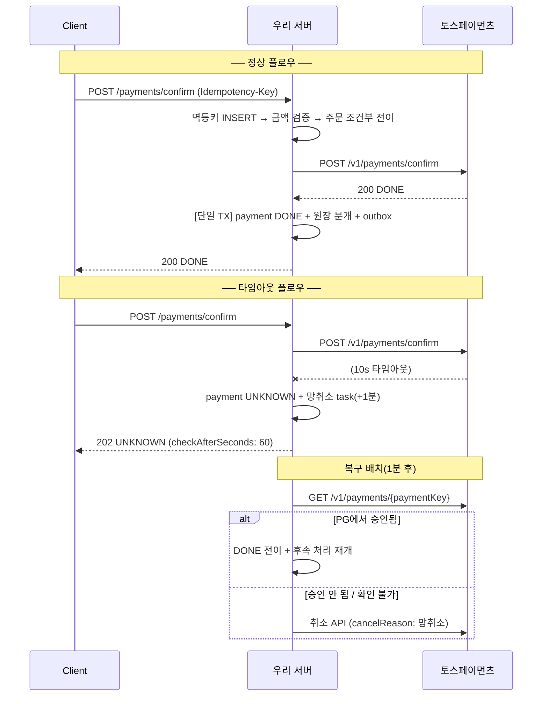

# 10. API 스펙 — 엔드포인트 설계와 에러 시맨틱

> 토스페이먼츠 API 디자인(멱등키·에러 코드 체계)을 우리 서버에도 동일하게 적용한다 — "PG를 써본 사람"이 아니라 "PG를 만드는 사람"의 관점.
> Base URL: `/api/v1` / 인증: 생략(포트폴리오 범위) 또는 간단한 Bearer / 모든 응답은 JSON

## 0. 공통 규약

### 요청 헤더

| 헤더 | 필수 | 설명 |
|---|---|---|
| `Idempotency-Key` | 쓰기 API 필수 | UUID, 최대 300자. **(키 + 경로 + 메서드)** 조합으로 중복 판별 |
| `X-Request-Id` | 선택 | 없으면 서버 생성. 모든 로그·응답에 traceId로 에코 |

### 공통 에러 응답 형식

```json
{
  "code": "AMOUNT_MISMATCH",
  "message": "결제 요청 금액이 주문 금액과 일치하지 않습니다.",
  "traceId": "01J9XYZ..."
}
```

### 공통 에러 코드

| HTTP | code | 상황 |
|---|---|---|
| 400 | `INVALID_REQUEST` | 필드 검증 실패 |
| 400 | `INVALID_IDEMPOTENCY_KEY` | 멱등키 형식 오류 (누락·300자 초과) |
| 404 | `PAYMENT_NOT_FOUND` / `ORDER_NOT_FOUND` | 대상 없음 |
| 409 | `IDEMPOTENT_REQUEST_PROCESSING` | 같은 멱등키의 이전 요청이 아직 처리 중 → **클라이언트는 잠시 후 같은 키로 재시도** |
| 409 | `INVALID_STATE_TRANSITION` | 상태머신 위반 (예: CANCELED 건 승인 시도) |
| 409 | `CONCURRENT_MODIFICATION` | 낙관적 락 충돌 → 재시도 안내 |
| 422 | `IDEMPOTENCY_KEY_REUSED` | 같은 멱등키 + **다른 요청 본문** (토스페이먼츠와 동일 시맨틱) |
| 502 | `PG_ERROR` | PG가 명시적 실패 응답 (비즈니스 거절은 별도 코드) |
| 504 | `PG_TIMEOUT` | PG 응답 없음 → 결제는 `UNKNOWN` 상태로 저장됨 (아래 승인 API 참고) |

---

## 1. 주문

### `POST /api/v1/orders` — 주문 생성

```json
// Request
{
  "items": [ { "productId": 1, "quantity": 2 } ],
  "pointAmount": 0
}

// Response 201
{
  "orderNo": "01J9XYZABC...",        // ULID — PG 결제창의 orderId로 그대로 사용
  "totalAmount": 20000,
  "status": "PENDING_PAYMENT",
  "expiresAt": "2026-07-05T12:30:00Z"   // 30분 (PG EXPIRED 정책과 동기화)
}
```

- 이 시점에 **서버가 `totalAmount`를 확정 저장** — 이후 금액 위변조 검증의 기준값
- 재고는 여기서 차감하지 않는다 (승인 시점 차감 — 선점 방식과의 트레이드오프는 ADR로)

### `GET /api/v1/orders/{orderNo}` — 주문 조회 (결제 상태 포함)

---

## 2. 결제 — 핵심 API

### `POST /api/v1/payments/confirm` — 결제 승인 ★

프론트가 successUrl로 받은 파라미터를 그대로 전달하면, 서버가 검증 후 PG 승인을 호출한다.

```json
// Request  (Idempotency-Key 필수)
{
  "paymentKey": "tosspayments가 발급한 키",
  "orderNo": "01J9XYZABC...",
  "amount": 20000
}
```

**서버 내부 처리 순서** (각 단계가 곧 방어선):
```
1. 멱등키 INSERT 시도 → 중복이면 저장된 첫 응답 반환 / 처리중이면 409
2. 금액 검증: amount == orders.total_amount → 불일치 시 403 AMOUNT_MISMATCH + 경고 로그
3. 주문 상태 조건부 전이: PENDING_PAYMENT → PAYMENT_IN_PROGRESS (영향 행 0이면 409 — 이중 지불 차단)
4. PG 승인 API 호출 (타임아웃 10s, PG에도 멱등키 전달)
   ├─ 성공     → payment DONE, 주문 PAID, 원장 분개 + outbox 이벤트 (같은 트랜잭션)
   ├─ 명시 실패 → payment ABORTED, 주문 PENDING_PAYMENT 복귀, 실패 사유 반환
   └─ 타임아웃  → payment UNKNOWN + compensation_task(망취소, +1분) 등록 → 202 반환
5. 멱등키 레코드에 최종 응답 저장
```

```json
// Response 200 — 승인 완료
{
  "paymentId": 123,
  "orderNo": "01J9XYZABC...",
  "status": "DONE",
  "amount": 20000,
  "method": "CARD",
  "approvedAt": "2026-07-05T12:01:23Z",
  "receiptUrl": "https://..."
}

// Response 202 — 승인 미확정 (UNKNOWN) ★ 이 응답의 존재가 차별화 포인트
{
  "paymentId": 123,
  "status": "UNKNOWN",
  "message": "결제 결과를 확인하고 있습니다. 잠시 후 결제 내역에서 확인해 주세요.",
  "checkAfterSeconds": 60
}

// Response 400 — PG 비즈니스 거절 (재시도 무의미)
{
  "code": "PG_REJECTED",
  "pgCode": "REJECT_CARD_COMPANY",
  "message": "카드사에서 거절되었습니다. 다른 카드로 시도해 주세요.",
  "retryable": false          // ★ hard/soft decline 구분을 클라이언트에 노출
}
```

**설계 결정**
- **타임아웃을 200/500이 아닌 202로 응답** — "성공도 실패도 아닌 상태"를 API 계약에 명시. 클라이언트는 폴링(`GET /payments/{id}`)으로 확정을 확인
- `retryable` 필드: 04·08 문서의 hard/soft decline 분류를 API 계약으로 노출

### `GET /api/v1/payments/{paymentId}` — 결제 조회

```json
// Response 200
{
  "paymentId": 123,
  "orderNo": "01J9XYZABC...",
  "status": "PARTIAL_CANCELED",
  "amount": 20000,
  "balanceAmount": 15000,
  "cancels": [
    { "cancelAmount": 5000, "cancelReason": "고객 요청", "transactionKey": "...", "canceledAt": "..." }
  ],
  "history": [
    { "from": "READY", "to": "IN_PROGRESS", "triggeredBy": "USER", "at": "..." },
    { "from": "IN_PROGRESS", "to": "DONE", "triggeredBy": "USER", "at": "..." },
    { "from": "DONE", "to": "PARTIAL_CANCELED", "triggeredBy": "USER", "at": "..." }
  ]
}
```

### `POST /api/v1/payments/{paymentId}/cancel` — 취소 (전액/부분)

```json
// Request  (Idempotency-Key 필수)
{
  "cancelReason": "고객 변심",
  "cancelAmount": 5000          // 생략 시 전액취소 (토스페이먼츠와 동일 규약)
}
```

**서버 내부 처리**: 멱등키 → `cancelAmount ≤ balanceAmount` 검증(조건부 UPDATE) → PG 취소 호출 → payment_cancels 기록 + balance 차감 + **역분개** + outbox 이벤트. PG 타임아웃 시 취소도 UNKNOWN → 복구 배치 대상

| 에러 | code |
|---|---|
| 400 | `CANCEL_AMOUNT_EXCEEDED` — 취소 가능 잔액 초과 |
| 409 | `INVALID_STATE_TRANSITION` — DONE/PARTIAL_CANCELED 외 상태에서 취소 시도 |

---

## 3. 웹훅

### `POST /api/v1/webhooks/tosspayments` — PG 웹훅 수신

**동기 구간은 3가지만** (10초 제한 대응):
```
1. (자체 Mock PG 사용 시) HMAC-SHA256 서명 검증 + timestamp tolerance 5분
2. external_event_id 멱등 INSERT — 중복이면 그대로 200 (재전송은 정상 동작)
3. raw_payload 저장 → 즉시 200
```
이후 비동기 워커: **조회 API로 실상태 재검증 → 상태머신 전이** (웹훅 페이로드를 신뢰하지 않음)

- 응답: 항상 `200 {"received": true}` (파싱 실패해도 200 — 저장은 됐으므로. 5xx를 주면 PG가 최대 7회 재전송)
- 검증 실패만 401 (서명 위조 시도)

---

## 4. 어드민 (백오피스)

> 모든 어드민 쓰기 API는 `X-Admin-Id` + 사유 필수, 행위 자체를 감사 로그에 기록

| 메서드 | 경로 | 기능 |
|---|---|---|
| GET | `/admin/payments` | 복합 검색 (orderNo·paymentKey·기간·상태·금액, 커서 페이지네이션) |
| GET | `/admin/payments/{id}/timeline` | 결제 타임라인 (history + 웹훅 + 대사 결과 통합) |
| POST | `/admin/payments/{id}/force-cancel` | 강제 취소 — `{"reason": "...", "approverId": "..."}` maker-checker: 요청자 ≠ 승인자 검증 |
| POST | `/admin/payments/{id}/sync` | PG 조회 API 강제 동기화 (웹훅 누락 대응) |
| GET | `/admin/reconciliations?result=PENDING` | 대사 불일치 큐 |
| POST | `/admin/reconciliations/{id}/resolve` | 수기 대사 확정 — `{"resolution": "MATCHED_MANUALLY", "note": "..."}` |
| GET | `/admin/dlq` | DLQ 메시지 조회 |
| POST | `/admin/dlq/{id}/retry` | DLQ 재처리 |
| GET | `/admin/compensations?status=MANUAL` | 보상 실패 수동 처리 큐 |

---

## 5. 내부 배치 (API가 아닌 스케줄러 — 계약만 명시)

| 배치 | 주기 | 동작 |
|---|---|---|
| 복구 배치 | 1분 | `UNKNOWN`/`IN_PROGRESS` T분 초과 건 → PG 조회 → 확정/망취소 |
| 보상 배치 | 1분 | `compensation_tasks` PENDING + `next_retry_at` 도래 건 실행, 백오프 재시도 |
| Outbox 발행 | 5초 폴링 | PENDING → Kafka 발행 → PUBLISHED. 별도 배치: 5분 이상 미발행 감지 알림+재발행 |
| 주문 만료 | 1분 | PENDING_PAYMENT 30분 초과 → EXPIRED (가상계좌 확장 시 dueDate 스캔도 여기) |
| 정산 배치 | 일 1회 | 전일 `[00:00, 24:00)` DONE 건 집계 → settlements 생성 (재실행 멱등) |
| 대사 배치 | 일 1회 (D+1) | PG 파일 적재 → transaction_key 매칭 → 4분류 → 예외 큐 |

모든 배치는 **멱등** + 다중 인스턴스 안전(분산락 또는 조건부 UPDATE) — 배치 계약의 일부로 명시

---

## 6. 시퀀스: 정상 승인 vs 타임아웃



## 7. API 설계 원칙 요약 (README·면접용)

1. **모든 쓰기 API는 멱등** — 멱등키 계약이 곧 재시도 안전성의 근거
2. **미확정(UNKNOWN)을 API 계약에 노출** — 202 + 폴링 안내. 거짓 성공/거짓 실패를 응답하지 않는다
3. **재시도 가능 여부(`retryable`)를 서버가 판단해 알려준다** — 클라이언트가 카드사 거절을 재시도하는 낭비 방지
4. **웹훅은 저장과 응답만 동기, 해석은 비동기** — 그리고 페이로드가 아닌 조회 API를 믿는다
5. **어드민의 모든 쓰기는 사유 + 감사 로그 + (위험 행위는) 2인 승인**
