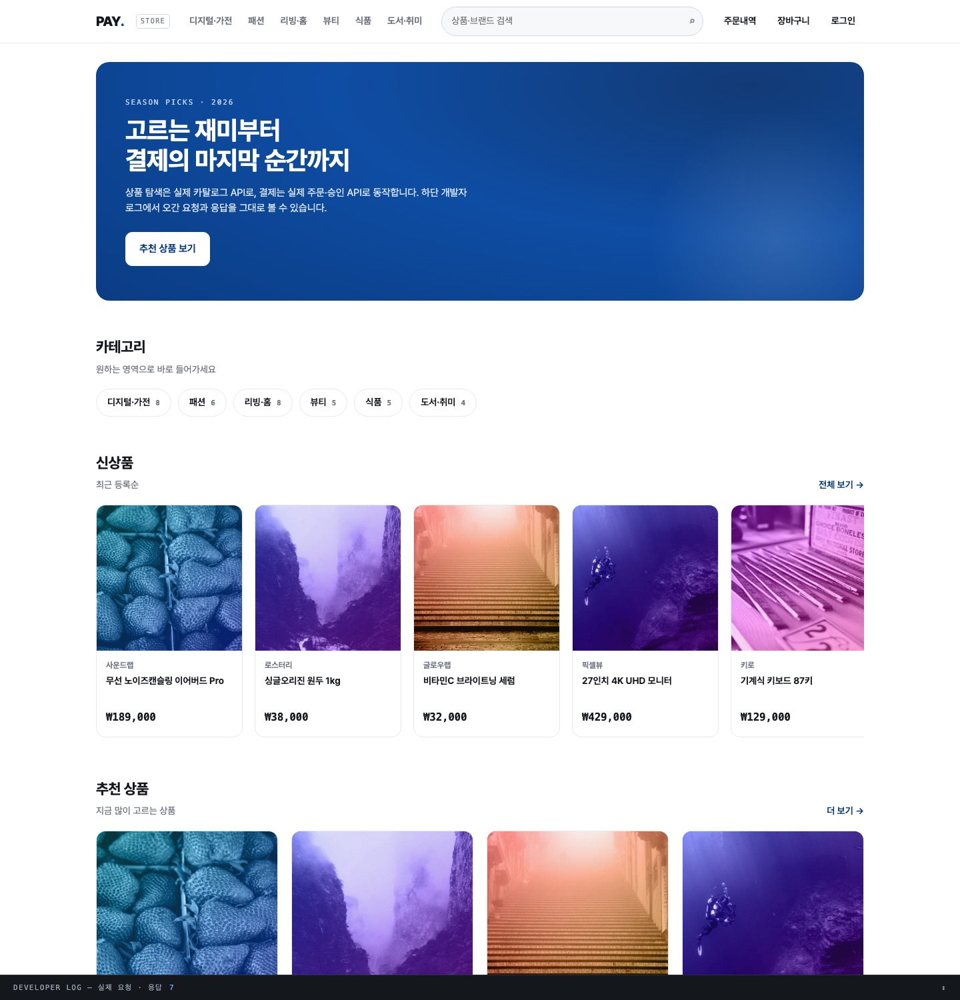
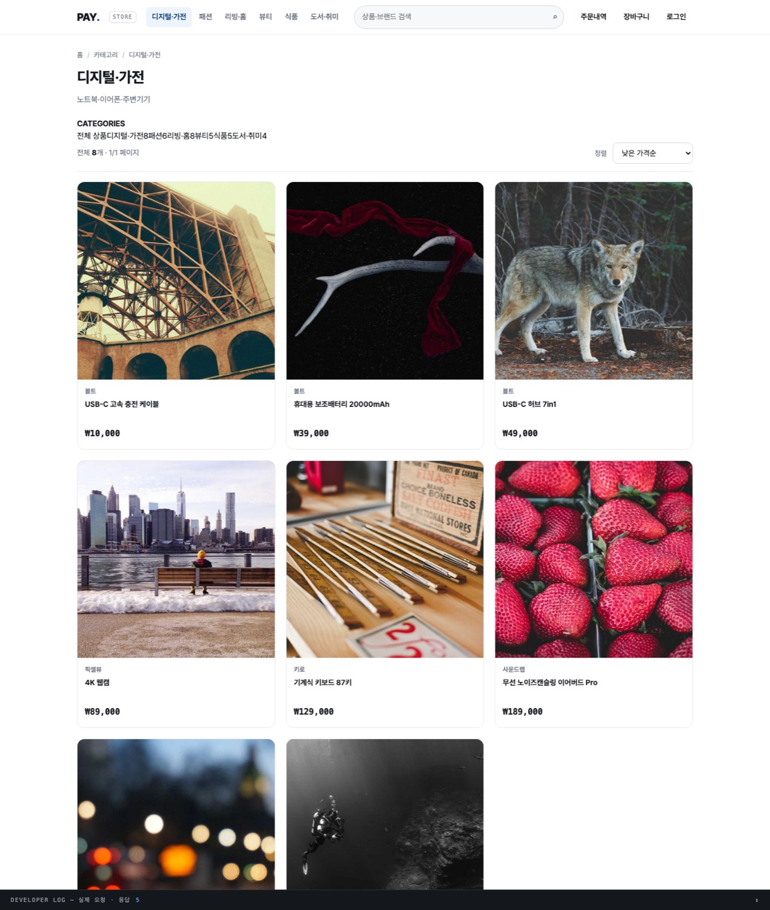
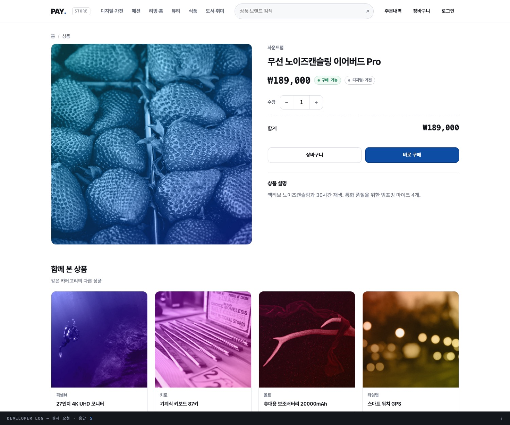
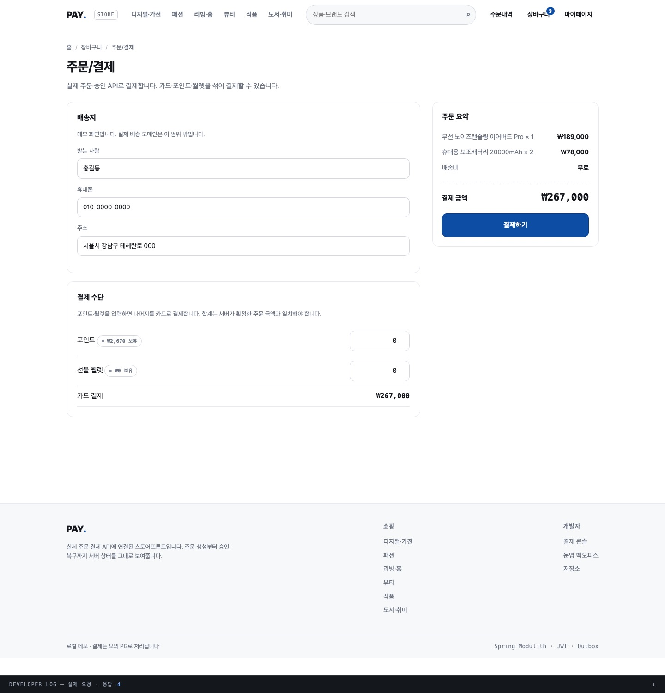
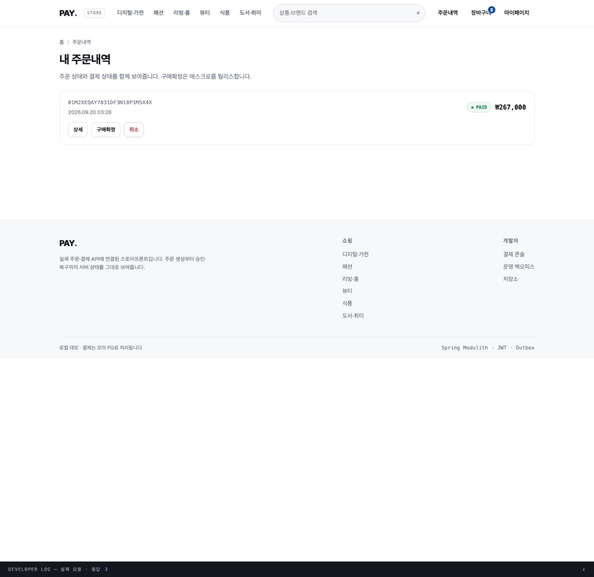

# 28. 스토어프론트 설계: 이커머스 화면과 결제 흐름

> 결제 데모 콘솔 하나뿐이던 정적 화면을 이커머스 쇼핑몰로 넓혔다. 이 문서는 화면 구성, 데이터
> 흐름, 그리고 화면이 실제 API에 붙는 방식을 정리한다. 카탈로그를 읽기 전용으로 연 이유와
> 대안은 [ADR-031](adr/ADR-031-storefront-catalog-read-api.md)에 있다.

## 1. 구성

별도 프런트엔드 서버·번들러 없이 Spring Boot가 정적 파일을 서빙한다. 모든 화면은 같은 출처에서
상대 경로로 API를 호출하므로 CORS가 필요 없다.

```
src/main/resources/static/
├── index.html          홈
├── category.html       카테고리
├── search.html         검색 결과
├── product.html        상품 상세
├── cart.html           장바구니
├── checkout.html       주문/결제
├── orders.html         내 주문내역
├── login.html          로그인/회원가입
├── console.html        기존 결제 콘솔(모듈 데모)
├── admin.html          운영 백오피스
└── assets/
    ├── store.css       디자인 시스템
    └── store.js        공용 런타임
```

`store.js`가 API 호출·인증·장바구니·헤더/푸터 주입을 모두 담는다. 화면 HTML은 본문 마크업과
그 화면의 스크립트만 갖는다 — 레이아웃을 고칠 때 한 파일만 보면 된다.

## 2. 화면과 호출 API

| 화면 | 경로 | 호출 |
| --- | --- | --- |
| 홈 | `index.html` | `GET /categories`, `/products?sort=newest`, `/products?featured=true` |
| 카테고리 | `category.html?code=&sort=&page=` | `GET /categories`, `/products?category=&sort=&page=` |
| 검색 | `search.html?q=&sort=&page=` | `GET /products?q=&sort=&page=` |
| 상품 상세 | `product.html?id=` | `GET /products/{id}`, `/products?category=` |
| 장바구니 | `cart.html` | (localStorage) |
| 주문/결제 | `checkout.html` | `POST /orders`, `POST /payments/confirm`, `GET /points`, `/wallet`, `GET /orders/{orderNo}` |
| 주문내역 | `orders.html` | `GET /orders`, `/orders/{orderNo}`, `POST /orders/{orderNo}/cancel`, `/confirm-purchase` |
| 로그인 | `login.html` | `POST /auth/login`, `/members/signup`, `/auth/logout` |

카탈로그 조회는 인증이 필요 없고(비로그인 탐색), 주문·결제·주문내역은 `ROLE_USER`가 필요하다.

## 3. 결제 흐름

체크아웃은 주문 생성과 승인을 분리한다. 금액은 화면이 아니라 서버가 확정한다.

```
1. 장바구니(localStorage) → POST /orders { items: [{productId, quantity}] }
   └─ 201 { orderNo, totalAmount, expiresAt }        ← 서버가 가격을 확정한 값
2. POST /payments/confirm { paymentKey, orderNo, amount(카드 몫),
                            pointAmount, walletAmount, installmentMonths }
   ├─ 200 DONE      → 장바구니 비우고 주문내역으로
   ├─ 202 UNKNOWN   → GET /orders/{orderNo} 의 paymentStatus 를 폴링해 확정
   └─ 400 거절      → 사유 표시, 같은 orderNo 로 재시도(새 멱등키)
```

**왜 주문 조회로 폴링하는가.** 승인 응답(`CheckoutResult`)에는 `paymentId`가 없다. 스펙
(10-API-스펙 §1·§2)이 "주문 단위 폴링으로도 확정을 확인할 수 있다"를 계약으로 적어 두었으므로
`paymentStatus`를 폴링한다.

**왜 주문을 한 번만 만드는가.** 승인이 실패해도 주문은 남는다(재고는 승인 시점 차감). 재시도할 때
주문을 다시 만들면 재고·금액이 흔들리므로, 실패한 승인은 같은 `orderNo`에 새 멱등키로 다시 건다.

## 4. 디자인 시스템

- **팔레트**: 결제 콘솔의 종이·잉크 톤을 계승하고 상품 그리드 중심으로 넓혔다(`--paper`·`--ink`·`--accent`).
- **컴포넌트**: 헤더(검색·장바구니 배지·계정), 상품 카드, 배지, 페이지네이션, 빈 상태, 토스트,
  스켈레톤, 개발자 로그 드로어.
- **상품 비주얼**: 시드 이미지는 외부 플레이스홀더라 상품과 내용이 무관하다. 상품 id로 만든
  그라디언트에 `mix-blend-mode: luminosity`로 블렌딩해 색조만 남긴 장식 타일로 쓴다. 사진 로드가
  실패하면 그라디언트 타일만 남아 레이아웃이 유지된다.
- **비로그인 탐색**: 홈·카테고리·검색·상세는 로그인 없이 동작한다. 결제·주문내역만 로그인을 요구하고,
  로그인 후 원래 화면으로 돌아온다(`next` 파라미터, 오픈 리다이렉트 방지).











## 5. 개발자 로그 드로어

모든 화면 하단에 요청·응답을 그대로 남긴다. 화면이 "미리 준비한 응답"이 아니라 실제 API를
호출한다는 것을 눈으로 확인할 수 있게 하려는 것이다 — 기존 콘솔의 성격을 그대로 이었다.

## 6. 한계

- **장바구니는 로컬에만 있다.** 서버에 저장하지 않는다. 가격은 주문 시점에 서버가 확정하므로
  위변조와는 무관하지만, 기기를 옮기면 사라진다.
- **배송 도메인이 없다.** 체크아웃의 배송지는 표시용이고 주문 API 계약은 그대로다.
- **검색은 부분 일치다.** 형태소 분석·동의어·랭킹이 없다(ADR-031).
- **재고 표시는 조회 시점 스냅샷이다.** 실제 차감은 승인 시점이라 그 사이에 품절될 수 있다.
- **상품 등록·수정 표면이 없다.** 카탈로그는 시드와 마이그레이션으로만 채운다.
