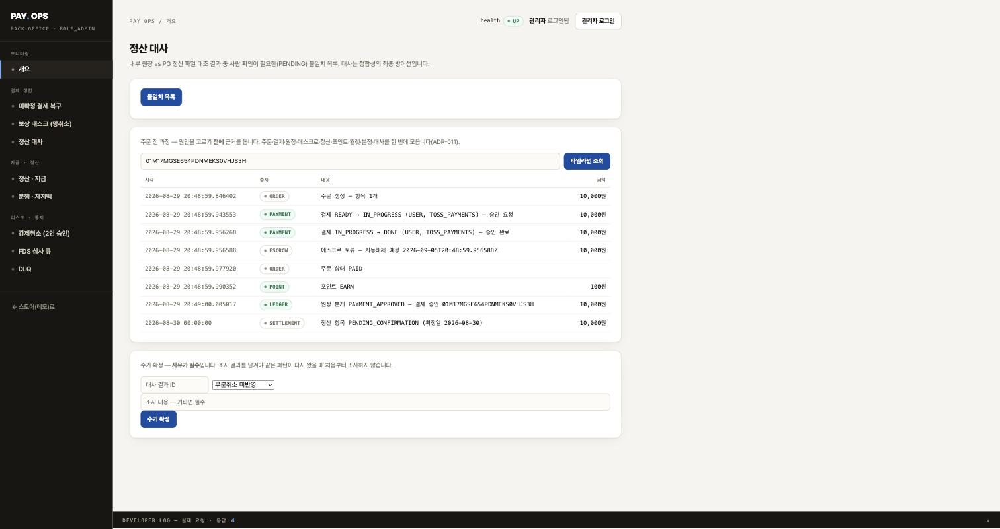
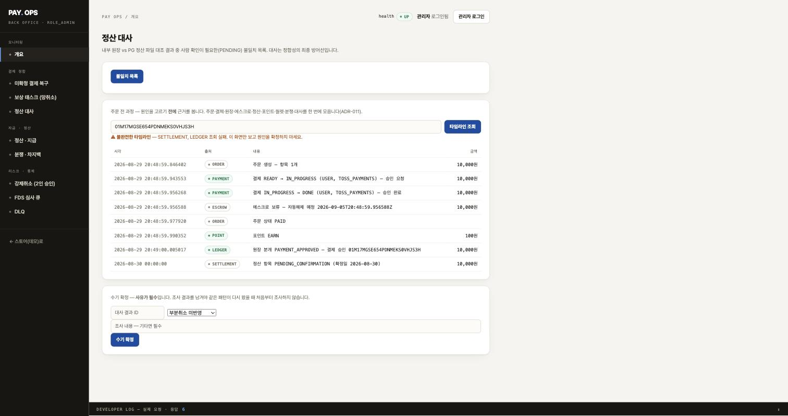

# ADR-011. 주문 한 건의 전 과정을 조립해 보여준다

- 상태: 채택 (Accepted) — API·화면·실측 완료
- 날짜: 2026-08-29
- 관련: [ADR-008](ADR-008-recon-mismatch-analysis-assistant.md), [ADR-010](ADR-010-what-not-to-build.md), [11 AI 운영 자동화 검토](../11-AI-운영자동화-검토.md)

## 맥락

[ADR-008](ADR-008-recon-mismatch-analysis-assistant.md)에서 대사 불일치의 수기 확정에
**원인 코드를 필수로** 받게 했다. 그런데 확정 화면이 사람에게 주는 정보는 이게 전부다.

```
orderNo, 내부금액, 외부금액, 대사시각
```

**"이 주문에 무슨 일이 있었는가"에 답이 없다.** 원인을 고르라고 해놓고 고를 근거를 주지 않았다.

### 지금 그 답을 얻으려면 (실측)

| 필요한 정보 | 현재 방법 |
|---|---|
| 주문 | `GET /api/v1/orders/{orderNo}` — **orderNo로 직접 되는 유일한 것** |
| 결제 | `GET /api/v1/payments/{paymentId}` — `paymentId`를 먼저 알아내야 함 |
| 대사 | `GET /admin/reconciliations/mismatches` — 전체 목록에서 사람이 찾음 |
| 원장 | `GET /admin/ledger` — **최근 N건만.** orderNo 필터 없음 |
| 정산 | `GET /admin/settlements` — 전체 목록 |
| 보상 | `GET /admin/compensations` — 상태별 목록 |
| 분쟁 | `GET /admin/disputes` — 전체 목록 |
| 에스크로 | **조회 API 없음** |
| 포인트 | **조회 API 없음** |
| 월렛 | **조회 API 없음** |
| 감사 로그 | **조회 API 없음** |

**API 호출 7회 + 목록에서 눈으로 찾기 6회, 그리고 4종은 아예 볼 수 없다.**

## 결정

`orderNo` 하나로 전 모듈을 훑어 **시간순 타임라인**을 조립하는 읽기 전용 조회를 만든다.
**AI는 쓰지 않는다** — 사실 조립은 결정적이어야 한다([11 문서 8절](../11-AI-운영자동화-검토.md)의 원칙 ①).

## 트레이드오프 1 — 모듈 경계를 어떻게 넘을 것인가

이 프로젝트는 Spring Modulith로 모듈 경계를 강제하고 `ModularityTests`로 검증한다.
`reconciliation`의 허용 의존은 `shared`·`payment`·`audit` 셋뿐이다.
**11곳을 읽으려면 이 경계를 어떻게든 넘어야 한다.**

### 안 1. 조립기를 `reconciliation`에 두고 의존을 늘린다

`allowedDependencies`에 `order`·`ledger`·`escrow`·`settlement`·`point`·`wallet`·`dispute`를 추가한다.

- ✅ 가장 적은 코드
- ❌ **`reconciliation`이 사실상 모든 모듈에 의존하게 된다.** 경계 검증이 통과는 하지만
  의미가 사라진다. "허용 목록에 적으면 뚫린다"가 되면 그 목록은 문서일 뿐이다
- ❌ 대사 모듈이 커진다. 대사는 대조가 일인데 조회 조립까지 떠안는다

**기각.** 오늘 이 프로젝트에서 반복해 확인한 것이 "경계를 만들어놓고 지키지 않으면
만들지 않은 것과 같다"는 것이었다.

### 안 2. 각 모듈이 조회 계약을 `shared`에 노출한다

`shared`에 `OrderTimelineContributor` 같은 인터페이스를 두고 각 모듈이 구현한다.

- ✅ 조립기는 인터페이스만 안다. 모듈 간 직접 의존이 안 생긴다
- ✅ **각 모듈이 "무엇을 남에게 보여줄지" 스스로 정한다**
- ❌ **`shared`의 규칙을 어긴다.** `package-info`에 이렇게 적혀 있다 —
  *"공유 커널은 '의존해도 되는 것'만 담아야 하며, **도메인 로직은 넣지 않는다**."*
  타임라인 항목은 값 타입이 아니라 **도메인 개념**이다
- ❌ shared가 커지기 시작하면 결국 모든 것이 shared로 간다

**기각.** 처음에 이 안을 고르려 했는데, `shared`의 자기 규칙을 읽고 물렸다.
**규칙을 어기면서 경계를 지킨다고 말할 수는 없다.**

### 안 3. 별도 조회 모듈을 만든다 ← **채택**

`timeline` 모듈을 새로 만들고, **그것만** 여러 모듈에 의존한다.

- ✅ 경계가 유지된다. 다른 모듈은 서로를 여전히 모른다
- ✅ **의존 방향이 한쪽이다.** `timeline → 나머지`이고 역방향이 없다.
  즉 어떤 모듈도 조회 때문에 오염되지 않는다
- ✅ `shared`가 값 타입만 담는다는 규칙이 유지된다
- ✅ 읽기 전용이라 **쓰기 경로가 섞이지 않는다.** 조회 모듈이 상태를 바꿀 수 없다
- ❌ 모듈이 하나 늘어난다
- ❌ **이 모듈은 의존이 많다.** 다만 그건 이 모듈의 일 자체가 "여러 곳을 모으는 것"이라
  본질적 복잡도이고, 그 복잡도를 **한 곳에 가둔 것**이 이 안의 요점이다

**이건 12 문서의 eBay Explainers와 같은 형태다.** 각 도메인이 자기 조각을 내주고,
조립기가 그것들을 모아 계층적으로 합친다. 그들이 거대 단일 LLM으로 실패하고 도달한 구조가
**"작은 도구들 + 조립"**이었다.

## 트레이드오프 2 — 조회를 API로 뚫을 것인가, 모듈 내부를 읽을 것인가

`timeline`이 각 모듈의 데이터를 얻는 방법도 둘이다.

- **HTTP로 자기 자신의 API 호출** — ❌ 기각. 같은 프로세스에서 자기 API를 부르는 건
  직렬화·네트워크 비용을 공짜로 내는 것이고, 트랜잭션도 끊긴다
- **각 모듈이 노출한 read 서비스/리포지토리를 직접 호출** — ✅ 채택.
  Modulith가 허용 의존으로 관리하므로 경계는 여전히 검사된다

## 트레이드오프 3 — 없는 조회 API를 어디까지 만들 것인가

에스크로·포인트·월렛·감사로그는 **`orderNo`로 조회할 수단이 아예 없다.**
이걸 만들면서 함께 노출해야 한다.

- **읽기 전용 조회만 추가한다.** 쓰기는 건드리지 않는다
- **각 모듈 안에 둔다.** 조회 메서드는 그 도메인의 것이지 `timeline`의 것이 아니다
- 이건 부수 효과가 아니라 **가치**다 — 지금은 운영 중에 "이 주문의 에스크로가 어떻게 됐나"를
  물을 방법이 없다

## 트레이드오프 4 — 리포지토리가 전부 package-private이다 (구현 중 발견)

안 3(별도 모듈)을 고르고 첫 기여자를 붙이려다 막혔다.
**각 도메인의 리포지토리가 전부 package-private이다.**

```java
interface OrderRepository extends JpaRepository<Order, Long> { }   // public이 아님
interface PaymentRepository ...                                    // 마찬가지
interface LedgerTransactionRepository ...                          // 마찬가지
```

엔티티(`Order`, `Payment`, `EscrowHold`)는 public인데 **리포지토리는 아니다.**
이건 실수가 아니라 의도로 보인다 — 다른 모듈이 남의 저장소를 직접 열지 못하게 막은 것이다.

그래서 선택이 다시 셋으로 갈린다.

### 안 A. 리포지토리를 public으로 연다

- ✅ 코드가 가장 적다
- ❌ **막아둔 것을 조회 편의를 위해 연다.** 한 번 열면 쓰기 경로도 열린다 —
  `timeline`은 읽기만 하겠다고 했지만, public이 된 리포지토리는 누구나 `save()`를 부를 수 있다
- ❌ 도메인 모듈이 자기 저장 구조를 숨길 수 없게 된다

**기각.** 조회하려고 캡슐화를 깨는 건 대가가 너무 크다.

### 안 B. 각 도메인이 read 서비스를 public으로 노출한다 ← **채택**

`OrderTimelineFacts` 같은 **읽기 전용 조회 서비스**를 각 모듈에 public으로 두고,
그 안에서 package-private 리포지토리를 쓴다.

- ✅ **리포지토리는 계속 숨겨진다.** 열리는 건 "무엇을 보여줄지"를 그 도메인이 정한 결과뿐이다
- ✅ 반환 타입도 도메인이 정한다. 엔티티를 그대로 내주지 않고 필요한 것만 담은 뷰를 준다
- ✅ **쓰기가 새지 않는다.** 조회 메서드만 있는 서비스라 `save`가 없다
- ❌ 모듈마다 클래스가 하나씩 는다(11개)
- ❌ 기여자 구현은 여전히 `timeline`에 산다. 도메인이 "요약 문장"까지 정하게 하려면
  기여자 자체를 도메인에 둬야 하는데, 그러면 `도메인 → timeline` 의존이 생겨
  **순환**이 된다(`timeline → 도메인`이 이미 있으므로)

**순환을 피하려고 요약 책임을 조립기 쪽에 남긴다.** 이건 안 3에서 "각 도메인이 자기 조각을
어떻게 요약할지 스스로 정한다"고 적은 것을 **일부 포기**하는 것이다. 정직하게 적어둔다 —
도메인은 **무엇을 내줄지**를 정하고, **어떻게 요약할지**는 `timeline`이 정한다.

### 안 C. 기여자 인터페이스를 `shared`에 두고 도메인이 구현한다

순환은 풀리지만 **`shared`에 도메인 개념이 들어간다.** 트레이드오프 1의 안 2와 같은 이유로 기각.

## 남는 한계

**요약 문장을 `timeline`이 만든다.** 즉 결제 상태의 의미가 바뀌면 `payment` 모듈과
`timeline` 양쪽을 고쳐야 한다. 이 결합은 남는다.

대안은 `shared`에 계약을 두거나(규칙 위반) 순환을 허용하는 것(더 나쁨)뿐이라,
**세 가지 나쁜 선택지 중 가장 덜 나쁜 것을 골랐다**는 것이 정확한 서술이다.

## 트레이드오프 5 — orderNo는 공용 키가 아니었다 (구현 중 발견)

기여자 인터페이스를 만들 때 javadoc에 이렇게 적었다.

> `orderNo` — **이 프로젝트의 모든 도메인이 공유하는 유일한 자연키다**

**틀렸다.** 붙이다 보니 두 곳이 다른 키를 쓴다.

| 도메인 | 실제 키 |
|---|---|
| 주문·에스크로·정산항목·월렛·포인트·대사 | `orderNo` ✅ |
| **결제 이력** | `payment_id` (FK) |
| **원장** | `(txType, sourceType, sourceId)` — `sourceId`가 **결제 id** |

이건 설계 실수가 아니다. 원장은 `sourceType`이 `PAYMENT`/`SETTLEMENT`/`DISPUTE`로 갈리므로
**주문이 아니라 "무엇이 이 분개를 만들었는가"로 묶는 게 맞다.** 결제 이력도 결제에 달리는 게 옳다.

### 그래서 조립을 두 단계로 나눈다

```
orderNo ──► (주문·에스크로·정산·월렛·포인트·대사)   1단계: 직접 조회
        └─► paymentId ──► (결제 이력·원장)          2단계: 해석 후 조회
```

- ✅ 각 도메인의 키 선택을 존중한다. 억지로 `orderNo` 컬럼을 심지 않는다
- ❌ 조립기가 **해석 순서를 알아야 한다.** 순수한 "모아서 정렬"이 아니게 된다
- ❌ 결제가 없으면(전액 포인트 주문) 2단계가 통째로 빈다. 그건 **정상**이므로
  빈 것과 실패한 것을 구분해야 한다

**대안이었던 "모든 테이블에 orderNo를 추가한다"는 기각했다.** 조회 편의를 위해 도메인의
키 설계를 바꾸는 것이고, 원장의 경우 `sourceType`이 `SETTLEMENT`일 때 orderNo가 무의미해진다
— 정산은 하루치를 묶으므로 주문 하나에 대응하지 않는다.

## 트레이드오프 6 — 읽을 때 조립할 것인가, 미리 만들어 둘 것인가 (업계 대조)

이건 이름이 붙은 갈림길이다. Chris Richardson의 마이크로서비스 패턴 카탈로그에서
**API Composition**과 **CQRS(읽기 모델)**로 나뉜다.

| | API Composition | CQRS 읽기 모델 |
|---|---|---|
| 언제 모으나 | **읽을 때** | **쓸 때**(이벤트로 미리 반영) |
| 일관성 | 항상 최신 | **최종 일관성**(이벤트 지연만큼 뒤처짐) |
| 저장소 | 추가 없음 | 뷰 테이블 추가 |
| 운영 부담 | 없음 | **이벤트 소비자**(재시도·DLQ·스키마 진화) |
| 알려진 단점 | 대규모 데이터셋에서 **비효율적 인메모리 조인** | 중복 이벤트·동시 갱신 처리 |

**pay는 이미 아웃박스와 이벤트가 있어서 CQRS 쪽도 실제로 가능하다.**
그래서 고민할 값어치가 있는 선택이었다.

### API Composition을 고른 이유

**① 이 패턴의 비용 대부분이 마이크로서비스 전제다.** 원전이 말하는 부담(팬아웃 지연,
부분 실패, 네트워크 왕복)은 **서비스 간 호출**을 가정한다. pay는 모놀리스이고 같은 DB를 쓰므로
**읽기 전용 트랜잭션 하나**로 묶인다. 직렬화도 네트워크도 없다.
같은 이름을 붙였다고 같은 비용을 내는 게 아니다.

**② 알려진 단점이 이 규모에서 발생하지 않는다.** *"대규모 데이터셋의 비효율적 인메모리 조인"*이
유일한 명시적 단점인데, 여기서 다루는 건 **주문 한 건**이다. 조인할 것이 없다.

**③ 조회 빈도가 낮다.** 사람이 대사 불일치를 열어볼 때만 돈다. 초당 수천 번 도는 화면이 아니다.
미리 만들어 둘 이유가 없다.

**④ 대사에서는 최종 일관성이 오히려 해롭다.** 대사는 "지금 내부 기록이 무엇인가"를 묻는 일인데,
읽기 모델이 이벤트 지연만큼 뒤처지면 **뒤처진 값으로 원인을 판단**하게 된다.
읽을 때 조립하면 그 문제가 없다.

### 언제 이 결정을 뒤집나

카탈로그가 이렇게 말한다 — *"여러 조합 쿼리를 위해 구체화 뷰를 만들고 있다면
사실상 CQRS를 구현하고 있는 것이니 그냥 받아들여라."*

**즉 타임라인 같은 조합 조회가 여러 개로 늘어나면** 그때 CQRS로 간다.
지금은 하나뿐이므로 아니다. ([ADR-010](ADR-010-what-not-to-build.md)의 "조건을 적어두는 것이
기각의 일부"에 해당한다.)

### 조사에서 못 찾은 것 (정직하게)

*"결제사가 CS용 주문 타임라인을 어떻게 만드는가"*에 대한 **1차 엔지니어링 블로그를 찾지 못했다.**
검색 결과가 대부분 CS 도구 벤더의 제품 소개였다. 즉 **패턴 수준의 근거는 있지만
구체적 사례 근거는 약하다.** 이 설계는 카탈로그 패턴을 이 상황의 제약에 맞춰 적용한 것이지,
누가 이렇게 했더라를 따른 것이 아니다.

## 트레이드오프 7 — 화면이 불완전한 타임라인을 어떻게 보여줄 것인가

조립기는 부분 실패를 살리고 빠진 출처를 응답에 싣는다. **그런데 화면이 그걸 안 그리면
아무 소용이 없다** — 서버는 정직한데 화면이 감추면 결과는 같다.

- **빠진 출처를 조용히 무시** — ❌ 최악. "그 도메인에 기록이 없다"로 읽힌다
- **불완전하면 화면 전체를 막음** — ❌ 하나 죽었다고 조사를 못 하게 만든다
- **그리되 경고를 띄운다** — ✅ 채택. 노란 배너로
  *"불완전한 타임라인 — SETTLEMENT 조회 실패. 이 화면만 보고 원인을 확정하지 마세요"*

화면은 서버가 조립한 것을 **그대로 그린다.** 금액을 다시 계산하거나 순서를 다시 정하지 않는다 —
두 곳에서 같은 계산을 하면 언젠가 갈라진다.

**배치 위치도 결정이다.** 타임라인 패널을 수기 확정 패널 **바로 위**에 뒀다.
원인을 고르는 입력 바로 앞에 근거가 있어야 한다.

## 트레이드오프 8 — 화면에 XSS를 새로 만들 뻔했다 (보안 리뷰가 잡음)

타임라인 행을 `innerHTML` 문자열 조립으로 그렸다. 자동 보안 리뷰가 **HIGH**로 잡았고,
확인해 보니 **실제 악용 경로가 있었다.**

```
차지백 웹훅(외부) → Dispute.reason → 타임라인 summary → innerHTML
어드민 입력      → ForceCancel.reason → payment history reason → summary → innerHTML
```

**저장형 XSS다.** 공격자가 웹훅 사유에 스크립트를 심고, 관리자가 대사 화면을 열면 실행된다.
그리고 하필 **관리자 세션이 이 시스템에서 가장 강한 권한**을 갖는다.

### 확인하다 더 큰 것을 발견했다

이 콘솔에 **이스케이프 함수가 아예 없었다.** `innerHTML`이 14곳에서 쓰이고,
기존 `renderList`/`fmt`도 서버 값을 그대로 넣고 있었다.
**내가 새 인스턴스를 하나 추가한 것이지, 문제를 만든 건 아니었다** — 원래 있었다.

### 조치

- `esc()` 헬퍼를 추가하고 **타임라인과 기존 `renderList`·`fmt`에 모두 적용**했다.
  내 코드만 고치면 같은 구멍이 13곳 남는다
- 상태 배지는 `map`에 있는 **알려진 enum일 때만** 붙인다. 그 외 임의 문자열은 이스케이프한 것을 낸다
- 남은 `innerHTML` 보간 4곳을 훑어 안전함을 확인했다
  (`logLine`은 자체 이스케이프, `role`·`d.status`는 코드가 정한 상수)

### 배운 것

**오늘 문서에 프롬프트 인젝션을 "막을 수 없으니 뚫린다고 가정하고 권한을 설계한다"고 적어놓고,
그 HTML 판을 내 손으로 만들었다.** 외부 입력이 어디까지 흘러가는지는 설계할 때가 아니라
**그릴 때** 다시 물어야 한다.

## 트레이드오프 9 — 키가 세 종류였다 (감사로그를 붙이며)

트레이드오프 5에서 키가 둘이라고 적었는데, 감사로그를 붙이니 **셋**이었다.

| 키 | 쓰는 곳 |
|---|---|
| `orderNo` | 주문·에스크로·정산항목·월렛·포인트·대사 |
| `paymentId` | 결제 이력·원장 |
| **`(targetType, targetId)`** | **감사로그** |

그리고 감사로그의 키가 그런 것도 **맞다.** 감사로그는 "누가 무엇에 손댔나"를 남기는 것이라
대상이 주문일 수도, 결제일 수도, 대사 결과일 수도 있다. 한 종류로 강제하면 그 목적을 잃는다.

### 3단계 해석

```
orderNo ──► 주문·에스크로·정산·월렛·포인트·대사        1단계
        └─► paymentId ──► 결제 이력·원장               2단계
                      └─► (ORDER, PAYMENT, RECONCILIATION_RESULT) ──► 감사로그   3단계
```

감사 조회는 **대상 목록을 받는다.** 조립기가 앞 단계에서 알아낸 식별자들을 모아 넘긴다.

- ✅ 감사로그의 키 설계를 존중한다
- ✅ 나중에 강제취소·PII 열람이 감사를 남기기 시작하면 **대상만 추가하면 따라온다**
- ❌ 조립기가 해석 순서를 더 알게 된다. "모아서 정렬"에서 더 멀어졌다

**현재 감사를 남기는 유일한 경로가 대사 수기 확정**이라 실질적으로 그것만 잡힌다.
그래도 대상 목록 방식으로 만든 이유는 위의 두 번째 항목 때문이다 —
지금 편하려고 대사 전용으로 짜면 다음에 다시 뜯어야 한다.

## 측정

### 조회 경로

| 지표 | Before | After | 근거 |
|---|---|---|---|
| API 호출 수 | **7회** | **1회** | `GET /admin/orders/{orderNo}/timeline` |
| 사람이 목록에서 눈으로 찾는 횟수 | **6회** | **0회** | 전부 orderNo로 직접 조회 |
| **조회 자체가 불가능하던 정보** | **4종** | **0종** | 에스크로·포인트·월렛·감사로그 모두 조회 서비스 추가 |
| 붙은 도메인 | — | **10개** | 주문·결제·원장·에스크로·정산·포인트·월렛·분쟁·대사·감사 |
| 백오피스 화면 이동 | 6개 탭 | **1개(펼치기)** | 대사 화면에 타임라인 패널 추가 |
| **응답 시간(p95)** | — | **16.7ms** | 로컬 MySQL, 사건 8개 기준 |
| **DB 쿼리 수** | — | **25회** | 예상(10~14)보다 많다. 아래 참고 |

### 런타임 실측 (도커 없이)

| 지표 | 값 |
|---|---|
| 타임라인 1회당 **DB 쿼리 수** | **25회** |
| 응답 시간 중앙값 | **14.0ms** |
| p95 | **16.7ms** |
| 최대 | 20.4ms |

측정 조건: 로컬 MySQL 8.4(Homebrew), 주문 1건에 사건 8개, 워밍업 3회 후 20회 반복.

**쿼리 25회는 예상(10~14)보다 많다.** 예상이 틀렸다. 원인은 둘로 보인다.

- 기여자마다 **읽기 전용 트랜잭션을 따로 연다.** 각 `*TimelineFacts`에 `@Transactional(readOnly = true)`가
  붙어 있어 조립기의 바깥 트랜잭션 안에서 또 경계가 생긴다
- 감사 기여자가 **대상 3종을 각각 조회**한다(ORDER·PAYMENT·RECONCILIATION_RESULT).
  결제 id 해석까지 하므로 그것만 4~5회다

**지금은 고치지 않는다.** 14ms는 사람이 화면에서 누르는 조회로 충분하고,
[ADR-010](ADR-010-what-not-to-build.md) 기준으로 이를 요구하는 결함이 없다.
다만 **예상과 실측이 갈렸다는 사실은 남긴다** — 조회가 빈번해지거나 사건이 많은 주문에서
느려지면 여기부터 본다.

### 정렬에서 드러난 것 — 정산 항목이 맨 아래로 간다

실측 출력에서 정산 항목이 `00:00:00Z`로 찍혀 **맨 아래**에 붙었다.
정산 항목에는 시각이 없고 **확정일(날짜)만** 있어서 자정으로 놓았기 때문이다.

시각을 지어내지 않은 것은 맞지만, **정렬에서 미래 날짜가 뒤로 밀리는 부작용**이 드러났다.
실제로는 승인 직후 생긴 항목이다. 화면에서 "정산은 날짜 단위"라는 것이 읽히지 않으면
사람이 순서를 오해할 수 있다.

**남기는 한계다.** 고치려면 정산 항목에 생성 시각을 추가해야 하는데,
그건 조회 편의를 위해 도메인 스키마를 바꾸는 것이라 트레이드오프 5에서 기각한 것과 같은 성격이다.

### 화면 (실제 렌더)

**정상 — 한 번의 조회로 6개 도메인의 사실 8건**



주문 생성 → 승인 요청 → 승인 완료 → 에스크로 보류 → 주문 PAID → 포인트 적립 → 원장 분개 →
정산 항목이 시간순으로 나온다. **원인을 고르는 입력(아래 수기 확정 패널) 바로 위**에 있다.

**부분 실패 — 살리되 경고한다**



정산·원장 조회가 실패한 상황을 재현했다. **행은 그대로 남고**, 위에 경고가 붙는다 —
*"불완전한 타임라인 — SETTLEMENT, LEDGER 조회 실패. 이 화면만 보고 원인을 확정하지 마세요."*

이게 이 설계의 핵심 계약이다. 전부 버리면 조사를 못 하게 되고, 조용히 빼면
"그 기록이 없다"로 오독된다.

### 대신 검증한 것### 대신 검증한 것

앱을 못 띄우는 대신 **조립기의 계약을 테스트로 고정**했다(`OrderTimelineServiceTest`, 5건).
DB가 필요 없고 기본 스위트에서 매번 돈다.

- 도메인 등록 순서가 아니라 **일어난 순서**로 합친다
- 한 도메인이 실패해도 **나머지는 살리고**, 빠진 출처를 응답에 싣는다
- 전부 실패해도 예외를 던지지 않는다
- **사건이 없는 것과 조회가 실패한 것을 구분한다** (포인트를 안 쓴 주문은 정상)
- 같은 시각이면 출처 이름으로 **안정 정렬** (새로고침마다 순서가 바뀌지 않게)

가운데 둘이 이 설계의 핵심 계약이다. 깨지면 대사 담당자가 **잘못된 근거로 원인을 확정**한다.

## 하지 않는 것

- **AI 서술** — 타임라인이 먼저 있어야 재료가 생긴다. 그리고 품질 지표를 먼저 정해야 한다
  (Klarna 교훈, [12 문서 1-1](../12-AI-운영자동화-사례연구.md))
- **원인 자동 분류** — 실제 불일치 데이터를 만들어 본 뒤에 규칙을 짠다.
  가상의 데이터에 대고 규칙을 짜면 오늘 하루 종일 고친 것과 같은 물건이 된다
- **쓰기 경로** — 조회 모듈은 상태를 바꾸지 않는다
