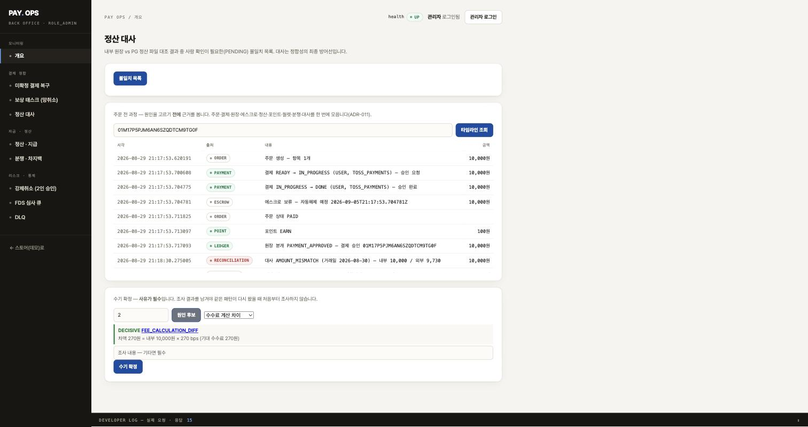

# ADR-012. 대사 불일치 원인을 규칙으로 제안한다 (AI 없이)

- 상태: 채택 (Accepted)
- 날짜: 2026-08-30
- 관련: [ADR-008](ADR-008-recon-mismatch-analysis-assistant.md), [ADR-011](ADR-011-order-timeline-assembly.md), [11 AI 운영 자동화 검토](../11-AI-운영자동화-검토.md)

## 맥락

[ADR-008](ADR-008-recon-mismatch-analysis-assistant.md)에서 수기 확정에 원인 코드를 필수로 받게 했고,
[ADR-011](ADR-011-order-timeline-assembly.md)에서 판단 근거(타임라인)를 한 화면에 모았다.
남은 질문은 **"원인 자체를 제안할 수 있는가"**다.

[11 문서](../11-AI-운영자동화-검토.md)에서 원인 8종을 세어본 결과 **6종이 산수나 조회로 결정된다.**
그래서 AI가 아니라 규칙으로 만든다 — 모델을 쓰면 **산수가 이미 답하는 것을 추측하게 만드는** 셈이고,
남는 위변조 의심은 추측이 가장 위험한 자리다.

## 결정

`CauseClassifier`가 불일치 하나에 대해 **원인 후보를 근거와 함께** 제안한다.
**확정하지 않는다** — `resolve`는 사람이 호출한다.

### 규칙

| 대사 분류 | 규칙 | 확신 |
|---|---|---|
| `AMOUNT_MISMATCH` | 차액 ≈ 내부금액 × 수수료율(±1원) | **DECISIVE** |
| | 차액 = 취소된 금액 (`amount − balance`) | **DECISIVE** |
| | 위 둘로 설명 안 됨 | WEAK (위변조 의심) |
| `INTERNAL_ONLY` | 이후 거래일 파일에 같은 주문이 잡힘 | **DECISIVE** (PG 파일 지연) |
| | 취소 이력 있음 | LIKELY (망취소 시점) |
| | 취소 없음 | LIKELY (PG 파일 지연) |
| `EXTERNAL_ONLY` | 내부에 기록 없음 | LIKELY (내부 기록 유실) |

**±1원 허용**은 반올림 방식 차이를 흡수하기 위한 것이다. 그 이상 벌어지면 수수료가 아니다.

### 왜 근거를 함께 내는가

> 차액 270원 = 내부 10,000원 × 270 bps (기대 수수료 270원)

**근거 없는 제안은 확인 비용만 늘린다.** 사람이 그 제안이 맞는지 알려면 어차피 처음부터
조사해야 하기 때문이다. 숫자를 함께 내면 **눈으로 검증**된다.

## 트레이드오프 1 — 규칙 사이에 순서가 필요했다 (실측에서 발견)

처음엔 각 규칙을 독립적으로 돌렸다. 실제 데이터로 돌려보니 이렇게 나왔다.

```
[DECISIVE] FEE_CALCULATION_DIFF    차액 270원 = 내부 10,000원 × 270 bps
[WEAK]     SUSPECTED_TAMPERING     취소 이력이 없는데 외부가 270원 적다.
                                   수수료로도 설명되지 않으면 확인이 필요하다
```

**근거 문장과 동작이 어긋난다.** *"수수료로도 설명되지 않으면"*이라고 써놓고
설명된 경우에도 붙였다. 그러면 사람이 **매번 배제 확인을 해야 해서 제안이 오히려 일을 늘린다.**

**그래서 규칙에 순서를 뒀다.** 설명이 되는 원인을 찾으면, "설명되지 않는다"를 전제로 만든
후보는 내지 않는다. 대신 배제 사유를 근거에 남긴다 —
*"차액 5,000원이 수수료(270원)로도 취소로도 설명되지 않는다. 취소 이력이 없다."*

## 트레이드오프 2 — 확신 수준과 자동 확정을 분리한다

`DECISIVE`는 **"증거가 정확히 맞아 다른 해석이 없다"**는 뜻이지
**"자동으로 확정해도 된다"**는 뜻이 아니다.

업계 조사([12 문서 6-6](../12-AI-운영자동화-사례연구.md))에서 확인한 원칙을 따른다 —
자동화 권한은 신뢰도만으로 정당화되지 않고, ① 성숙·감사된 샘플 ② 증거 신선도
③ 선언된 위험 한도 내 실측 오류율이 **함께** 충족돼야 한다.

**지금은 자동 확정을 켜지 않는다.** 실측 오류율을 낼 만한 데이터가 없기 때문이다.
그 데이터는 사람이 확정을 쌓아야 생긴다.

## 트레이드오프 3 — 목록이 아니라 건별 조회로 둔다

`GET /{id}/suggestions`로 분리했다. 목록 조회에 끼우면 20건짜리 페이지를 그릴 때마다
20번 분류가 돌고 결제 조회가 그만큼 늘어난다. **사람이 한 건을 열어볼 때만 필요하다.**

## 실측 검증

가상 데이터가 아니라 **실제 대사를 돌려 만든 불일치**로 확인했다.
결제 4건을 만들고, 수수료 차이·부분취소 크기·누락·유령 주문을 담은 CSV를 넣어
`AMOUNT_MISMATCH` 2건, `INTERNAL_ONLY` 2건, `EXTERNAL_ONLY` 1건을 생성했다.

| 대사결과 | 실제 상황 | 분류기 제안 |
|---|---|---|
| #2 | 차액 270원(= 2.7%) | **DECISIVE** 수수료 차이 |
| #4 | 차액 5,000원, 취소 없음 | WEAK 위변조 의심 + 배제 사유 |
| #1·#5 | 내부에만 존재 | LIKELY PG 파일 지연 |
| #6 | 외부에만 존재 | LIKELY 내부 기록 유실 |

**규칙이 실제 데이터를 정확히 가른다.** 그리고 위의 트레이드오프 1은 이 실측에서 발견했다 —
단위 테스트만 짰으면 못 봤을 것이다.

## 트레이드오프 4 — `esc()`는 "속성 안의 JS"에는 통하지 않는다 (보안 리뷰가 잡음)

제안 링크를 이렇게 만들었다가 자동 보안 리뷰가 **HIGH**로 잡았다.

```js
'<a onclick="pickCause(\''+esc(sug.cause)+'\')">'
```

`esc()`가 `'`를 `&#39;`로 바꾸니 안전해 보인다. **아니다.**
**HTML 파서가 JS 파싱보다 먼저 엔티티를 디코드**하므로 `&#39;`가 다시 `'`가 되고,
`x');alert(1);('` 같은 값이면 따옴표를 탈출한다.

**`esc()`는 HTML 텍스트 컨텍스트용이지 속성 안의 JS 컨텍스트용이 아니다.**
앞서 [ADR-011 트레이드오프 8](ADR-011-order-timeline-assembly.md)에서 XSS를 고치며
`esc()`를 도입했는데, 그걸 **다른 컨텍스트에 그대로 쓴 것**이 이번 실수다.

### 지금 뚫리지는 않는다 — 그래도 고쳤다

`sug.cause`는 `ResolveCause` **enum**이라 서버가 값을 정한다. 공격자가 넣을 수 없다.

그래도 고친 이유는 둘이다.

- 나중에 자유 서술 원인이 추가되거나 직렬화가 바뀌면 **조용히 뚫린다.**
  "지금은 enum이니까"에 기대는 안전은 다음 사람이 모른다
- **패턴 자체가 틀렸다.** 문자열로 이벤트 핸들러를 조립하면 이스케이프가 어느 층에서
  필요한지 매번 따져야 한다

**조치**: `document.createElement` + `addEventListener`로 바꿨다.
값을 문자열이 아니라 **변수로** 넘기면 속성 층 자체가 사라진다.

**브라우저에서 검증했다.** 따옴표 탈출 페이로드를 넣고 링크를 클릭해도 실행되지 않고,
텍스트로만 들어간다. `onclick` 속성도 남지 않는다.

## 화면 — 근거에서 확정까지 한 자리에서



위에 [타임라인](ADR-011-order-timeline-assembly.md)이, 아래에 원인 제안과 확정 입력이 있다.
**조사(위) → 제안(가운데) → 확정(아래)** 순서로 시선이 흐른다.

- 제안을 누르면 **드롭다운만 채워진다.** 확정은 여전히 사람이 버튼을 눌러야 일어난다
- 확신 수준을 색으로 구분한다 — DECISIVE 초록, LIKELY 주황, WEAK 회색
- 근거가 제안 바로 아래 붙어 있어 **눈으로 검증**된다
- 규칙이 못 가르면 *"직접 조사해 사유를 남기세요"* — 억지로 하나 고르지 않는다


## 커버리지를 세어서 확인한다 (2026-08-30 추가)

이 문서는 "8종 중 6종이 산수나 조회로 결정된다"고 적었다. **그런데 코드에는 규칙이 5개뿐이었다.**
`TIMEZONE_BOUNDARY`는 enum 에만 있고 아무도 내지 않았는데, 위 표에서는 자동 확정 후보로까지
올려놨다. 개별 규칙 테스트는 "이 입력에 이 원인이 나오는가"만 보므로 **아무도 안 내는 원인은
영원히 안 보인다.**

`CauseCoverageHarnessTest` 가 반대 방향으로 본다 — 원인 목록 전체를 놓고 어느 자리가 비는지 센다.

| 등급 | 종수 | 원인 |
|---|---:|---|
| 산수로 결정 (DECISIVE) | 4 | 부분취소 미반영 · 수수료 차이 · **거래일 경계** · PG 파일 지연 |
| 정황으로 제안 (LIKELY) | 2 | 승인 직후 취소 · 내부 기록 유실 |
| 배제로 남음 (WEAK) | 1 | 위변조 의심 — **사람이 봐야 한다** |
| 규칙 없음 | 1 | OTHER — AI 를 논할 자리 |

**세어보니 배운 것**: 처음엔 "7종을 가른다"고 셌다. 위변조 의심까지 넣었기 때문이다.
그런데 그건 배제법으로 **남은** 것이지 결정된 게 아니다. `결정 = DECISIVE + LIKELY = 6` 이
문서의 주장과 맞는 셈법이다. 이 구분이 흐려지면 "규칙이 대부분을 해결한다"고 과장하게 된다.

이제 테스트가 그 수를 고정한다. 규칙을 늘리거나 줄이면 깨지므로 문서와 코드가 같이 움직인다.

### 거래일 경계를 파일 지연과 구분하는 근거

둘 다 "내부에만 있음"으로 나타나지만 **대응이 정반대**다. 지연은 기다리면 맞춰지고,
경계는 기준을 고쳐야 한다. 가르는 조건은 두 가지를 함께 본다.

- 같은 주문이 **인접일(±1)** 에 외부 기록으로 있는가
- 승인 시각이 **자정에서 2시간 안**인가

두 번째가 핵심이다. 이걸 안 걸면 인접일에 기록이 있다는 이유만으로 전부 경계로 몰려,
정작 흔한 파일 지연을 경계로 잘못 부른다. 낮 2시 거래가 날짜를 넘어갈 일은 없다.

## 외부 분류표와 대조했다 (2026-08-31 추가)

원인 목록이 <b>빠진 게 없는지</b>는 스스로 세어서는 알 수 없다. 업계에서 반복되는
대사 예외 유형을 찾아 우리 목록과 맞춰봤다.

> 예외는 여섯 가지 패턴으로 반복된다 — **타이밍 격차, 금액 불일치, FX 변동,
> 은행 입금 누락, PSP 기록 누락, 중복**

| 업계 6유형 | pay | |
|---|---|---|
| 타이밍 격차 | `PG_FILE_DELAY` · `TIMEZONE_BOUNDARY` · `NET_CANCEL_TIMING` | 3종으로 세분 |
| 금액 불일치 | `FEE_CALCULATION_DIFF` · `PARTIAL_CANCEL_NOT_REFLECTED` | ✅ |
| PSP 기록 누락 | `PG_FILE_DELAY` (+ `INTERNAL_ONLY` 결과) | ✅ |
| 내부 기록 누락 | `INTERNAL_RECORD_LOST` | ✅ |
| **중복** | **없었다** | ← **구멍** |
| FX 변동 | 해당 없음 | `Money` 가 KRW 원 단위 `long` |

### 중복이 빠져 있었다

엔진은 <b>이미</b> 거래 식별자로 중복을 걸러내고 경고 로그를 남긴다. 그 코드에
"같은 거래가 중복 기록됨 — 합산하면 금액이 부풀어 불일치를 오히려 감춘다"라고 적혀 있다.

**그런데 확정하는 사람에게는 고를 어휘가 없었다.** `OTHER` 로 갈 수밖에 없고,
그러면 <b>반복돼도 집계에 안 잡힌다</b> — 이 enum 을 코드로 받는 이유가 무너진다.

두 가지를 채웠다.

- `DUPLICATE_RECORD` 를 원인에 추가했다
- 실행 요약이 **중복 행 수**를 싣는다. 로그는 예외 큐를 확정하는 사람이 보는 곳이 아니다

**규칙 제안은 붙이지 않았다.** 중복은 매칭 <b>전에</b> 걸러지므로 남은 불일치만 보고는
판단할 수 없다. 사람이 실행 요약을 근거로 고른다.

### 대조 자체를 테스트로 남겼다

`DuplicateRowVisibilityTest` 가 6유형 매핑표를 들고 있고, **비는 칸에는 왜 비었는지**를
쓰게 강제한다(FX 는 "KRW 전용"). 새 원인이 생기거나 통화가 늘면 여기가 먼저 걸린다.

**공개 데이터셋은 없었다.** 라벨된 대사 예외 데이터는 결제사 운영 데이터라 공개되지 않는다.
찾은 것은 데이터가 아니라 <b>분류표</b>였고, 그게 더 쓸모 있었다 —
표본이 없어도 <b>목록에 구멍이 있는지</b>는 확인할 수 있다.

## 하지 않는 것

- **AI로 분류하기.** 6종이 산수로 결정되므로 추측할 이유가 없다
- **자동 확정.** 실측 오류율이 없다. 데이터가 쌓인 뒤 판단한다
- **억지로 후보 내기.** 아무것도 못 가르면 빈 목록을 준다.
  하나 골라주면 사람이 그것에 끌려간다(앵커링 — [12 문서 3-3](../12-AI-운영자동화-사례연구.md))

## 트레이드오프 5 — 기준선을 만들어놓고 그 값을 몰랐다

이 문서 마지막에 *"이 분류기가 AI가 넘어야 할 기준선"*이라고 적었다.
**그런데 기준선의 값을 모르면 넘었는지도 모른다.**

### 정답은 사람의 확정에서 나온다

대사 담당자가 원인을 고르는 순간 그게 정답 라벨이다. 그래서 **확정 직전에 분류기를 한 번 더
돌려 제안과 대조**한다(`ClassifierAccuracyMetrics`). 그 시점이 둘을 함께 아는 유일한 순간이다.

집계는 넷으로 나눈다.

| outcome | 뜻 |
|---|---|
| `top` | 1순위 제안이 사람의 선택과 같다 |
| `candidate` | 후보 안에는 있었지만 1순위가 아니었다 |
| `miss` | 제안했지만 빗나갔다 |
| `none` | 제안을 못 냈다 |

**`candidate`와 `none`을 따로 세는 이유**: `none`이 많으면 정확도가 높아도 쓸모가 없고
(커버리지 문제), `candidate`만 높으면 "골라주긴 하는데 순서가 틀린" 것이다.
합쳐서 세면 이 둘이 안 보인다.

### 이 수치를 "정확도"라고 부르지 않는다

**사람이 제안을 보고 확정하므로 앵커링 편향이 있다.** 제안에 끌려간 확정이 `top`으로
집계된다. 즉 이 값은 실제 정확도의 **상한**에 가깝다.

편향 없는 값을 원하면 **제안을 감춘 상태에서 확정하는 표본**(blind review)이 따로 필요하다.
[12 문서 3-3](../12-AI-운영자동화-사례연구.md)의 Stripe 홀드아웃과 같은 발상이다.
**그 표본은 아직 없다.** 그래서 이 지표는 "정확도"가 아니라 **"일치율"**이다.

### 실측 검증

실제 확정 두 건으로 확인했다.

```
recon_classifier_outcome_total{cause="FEE_CALCULATION_DIFF",outcome="top"}  1.0
recon_classifier_outcome_total{cause="OTHER",outcome="miss"}               1.0
```

제안대로 확정하면 `top`, 다르게 확정하면 `miss`로 갈린다.

### 집계 실패가 업무를 막지 않는다

지표 계산을 `try/catch`로 감싸 실패해도 확정은 진행한다.
**관측 때문에 업무가 막히면 안 된다** — 이건 이 프로젝트에서 반복해 적용한 판단이다
(아웃박스 소비 실패가 결제를 막지 않는 것과 같다).

## 다음

이 분류기가 **AI가 넘어야 할 기준선**이고, 이제 그 값을 잴 수 있다
(`recon.classifier.outcome`). AI를 붙인다면 **같은 지표로 비교**해야 한다.

다만 순서가 있다. **일치율이 쌓이기 전에는 AI를 붙일 이유가 없다** —
비교 대상이 없으면 "나아졌다"고 말할 수 없기 때문이다.
그리고 앵커링 편향을 걷어내려면 blind review 표본을 함께 설계해야 한다.
